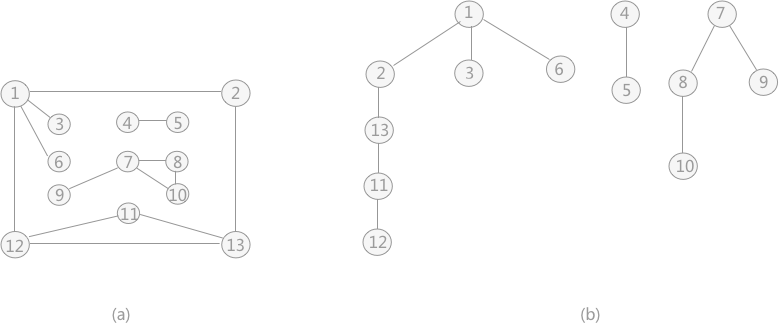
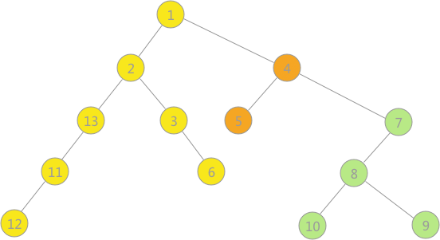
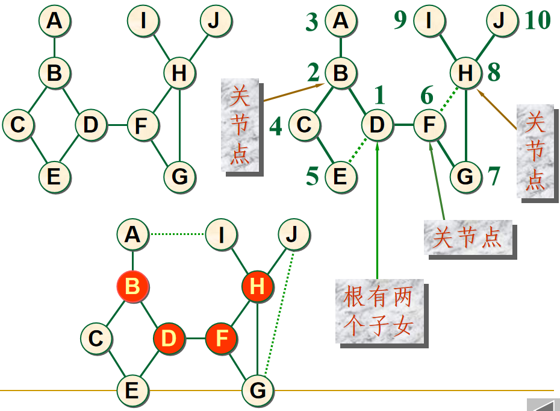
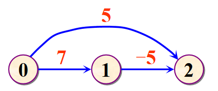
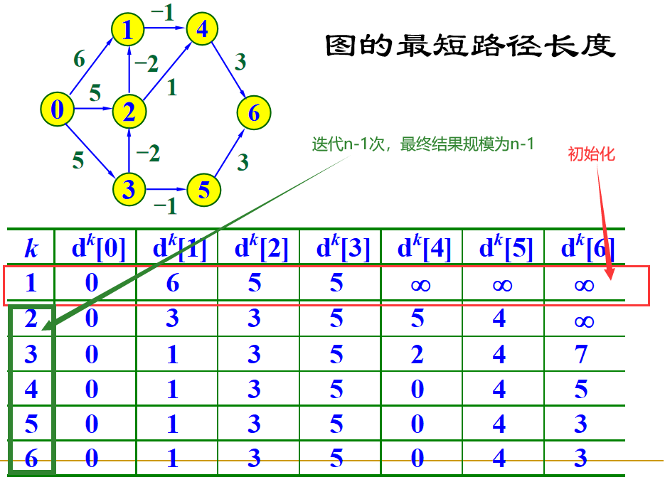

# 图(graph)

## 基本概念
就是点集V和边集E，用一个**点的二元组**表示边。
对于**无向图**，边用**圆括号**表示`(v1, v2)`；对于**有向图**，边用**尖括号**表示`<v1, v2>`。
> 可以看到，**“点”**才是图的核心，而**“边”**体现的是点之间的**关系**，是依附于点产生的概念，**没有点边就没有意义**。
> 
> 况且“边”就是用它的**两个顶点表示的**。

本章我们不对图这个概念深究，只考虑最简单的有向图和无向图，**不考虑自环**(即边的两点是同一个点)，也**不考虑无向图的多重边**(即两点之间有多条无向边)

* 完全图：无向图的完全图就是有`n(n-1)/2`条边的图，有向图是有`n(n-1)`条边的图（无向图的2倍，每条无向边变成两条有向边）
* 边的权值：可以表示边的距离，代价等等
* 点的度：点关联的**边的条数**，有向图还有**入度和出度**，为入度和出度**之和**
* 路径：我们的定义是路径是一系列**点**的**序列**。如果所有点都不重复则为**简单路径**，如果第一个点和最后一个点相同，则为**回路**，其余为**复杂路径**
* 连通图：无向图中，若**任意两点间**都有路径则称之为连通图；非连通图的**极大连通子图**叫做**连通分量**
> 一个**无向连通图**的**生成树**是它的**极小连通子图**，如果有n个点则有**n-1条边**，这是最小的连通保证
* 强连通图：有向图中，任意两点间可以**相互到达**，称其为强连通图；非强连通图的**极大强连通子图**叫做**强连通分量**
> 可以看到连通图是**无向图**的概念，强连通图是**有向图**的概念，浅浅区分一下😋


## 图的存储表示
注意这部分的实现，**不保证可以顺利编译通过**。

* 关于模板

受限图的ADT也就是那个`Graph`用的是模板抽象类，而邻接矩阵和邻接表实现是**继承自模板类**Graph的**模板类**。

C++关于模板的实现很乱我只能说😅**两次编译**啥的，一个很直观的例子就是：如果是模板类继承模板类，那么**父模板类**里的`public`或者`protected`变量在**子模版类**里**无法直接访问**。

这tm的简直荒谬😅原因和模板类二次编译有关，由于编译时未生成实际的模板代码，名字查找都是现场决议的，编写时只能在子类里通过:
```cpp
this->numEdges += 1; //this指针
Graph<T, W>::numEdges += 1; //基类名受限
```
两种方式来访问原本在普通子类里可以直接访问的东西。有云CS106L原话如下：
> Templates don’t emit code until instantiated, so #include the .cpp file in the .h file, not the other way around!

我只能说C++的水太深了😭

* 关于实现细节

实现上我是为了和课本课件一致使用了 `<class T, class W>`这种模板，但是诸如表示邻接矩阵两个点之间没有边时，理论上应该提供一个**类型为`W`的无穷大**。

但是我为了省事直接用`INT32_MAX`表示了
> 因此大概率编译不通过，反正也没打算跑通😋

### 邻接矩阵表示法

在 `GraphMatrix`类中实现的是**无向图**，也就是说二维矩阵`edgeMatrix`是**对称的**。
* 若 `i == j` 则 `edgeMatrix[i][j] = 0`
* 若  `edgeMatrix[i][j] = INT32_MAX`，表示点i和点j之间**没有边**
> INT32_MAX是偷懒的做法，前面已经说过了，应该实现一个T类型的表示无穷的实例才对🤭

**函数相关：**

需要注意，点的类型是`T`，实际点的值存放在 `vector<T> vertexList`中。

各种成员函数中参数和返回值的 `int v1, int v2`实际上是**该结点在`vertexList`中的下标位置**

### 邻接链表表示法

典中典的，二维矩阵很可能出现**稀疏矩阵**的情况，边很少，导致**内存的浪费**。

于是就有邻接链表表示法，但是需要清楚，这只是对于**内存的一种优化**，二维矩阵虽然空间复杂度大，但是数组**支持下标随机查询**非常快，属于**空间换时间**。

其实就是把邻接矩阵的**每一行组织成一个链表**。链表中的结点有**顶点的下标**和该**边的权值**，顶点表存有**该点的值**以及**出边链表**。

> 实现草草写下一下早点完事吧😭后面的各种算法才是重点

而且，有了STL谁tm还写链表啊😅顶点表是个 `vector<pair<T, vector<Edge>>>`，顶点表中存的是一个pair，T就是顶点的值，而`vector<Edge>`就是**出边链表**。

每个`Edge`有终点的**下标值**和**这条边的权值**两个域。

### 邻接多重表
课上没讲，那就不看了🙈浅浅看了一下发现好麻烦就是说

## 图的遍历
* 概念

从给定连通图的**某一个顶点**出发，沿着一些边访问图中的**所有顶点**，使每个顶点被访问且**仅被访问一次**，这就是图的**遍历**。

* 与树遍历的区分

我们知道树其实是一种特殊的图，即**边最少的连通图**，且边是**有向的**：即**从父结点指向子结点**。

因此原来树的遍历中我们根本不用考虑**每个结点只被访问一次**，因为边的方向导致树绝对不会像图那样**可能出现回路**，导致沿着边走很可能对点**重复访问**。

* 辅助数组

因此，为了**避免重复访问**，在图的遍历中，**不得不引入辅助数组**`bool visited[]`来标记某个点是否被访问过了。

### DFS深度优先搜索
典中典的递归了，注意为了不重复搜索，**必须要用**`visited`数组来标志某个顶点是否被访问过。

因为这是**遍历**，每访问一个顶点直接标记成 `visited[v] = true`，**不进行状态回退**
> 否则就成回溯了，这里就是纯纯遍历，不搞什么尝试花里胡哨的😋

代码如下：
```cpp
//从下标v开始递归DFS访问图G
template<class T, class W>
void DFS(Graph<T, W>& G, int v, vector<bool>& visited) {
    cout << G.getValue(v) << " " << endl; //访问这个点
    visited[v] = true;  //标记访问 防止重复访问
    int neighbor = G.getFirstNeighbor(v);   //邻居的下标
    while(neighbor != -1) { //递归DFS访问v的所有邻居
        if(!visited[neighbor]) //防止重复访问
            DFS(G, neighbor, visited);
        neighbor = G.getNextNeighbor(v, neighbor);
    }
}
```

这个函数是递归函数的内部调用本身，它外面还套了层外部调用`DFSearch()`，都是典中典了不废话了。

* **复杂度**：假设图中有n个顶点，e条边

如果用邻接矩阵，则每次找某个点的**邻接边**即`nextNeighbor`的时候需要遍历矩阵中的**第n行**，因此整体的复杂度为`O(n^2)`
> 和e完全没有关系，因为用邻接矩阵的话，找边还得遍历整个矩阵

而使用邻接矩阵的话，同样n个点，但找某个点的**邻接边**只需遍历链表，不多不少正好只需遍历e次，因此整体复杂度为`O(n+e)`
> 因为链表存的就确确实实是边的信息，而不会像矩阵那样有很多没用的空元素


### BFS广度优先搜索

还是用队列，和树一样的，区别同样还是需要用`visited`数组来防止重复遍历，不赘述了。

* **复杂度**：假设图中有n个顶点，e条边

和DFS的分析思路完全一样，问题的关键在于如何**确定某个顶点所有邻居**，邻接表复杂度为`O(n+e)`，比邻接矩阵`O(n^2)`要节约。


### 搜索的应用一：确定连通分量

显然在图中一个顶点开始搜索，只能遍历到**一个连通分量**的所有点。

于是可以尝试从**每个顶点**开始遍历，这样一定可以保证非连通图的**所有连通分量**都被遍历到，同时可以确定每个连通分量**由哪些点**构成。

代码很简单，就是遍历一番：
```cpp
template<class T, class W>
void Components(Graph<T, W>& G) {
    int v_count = G.getNumVertexs();
    vector<bool> visited(v_count, false);
    for(int i = 0; i < v_count; i++) {
        if(!visited[i]) {
            DFS(G, i, visited);
            cout << "-----------------------" << endl;   //每一个连通分量结束后都有分隔线
        }
    }
}
```

### 搜索的应用二：图的生成森林

对于**每一个**连通分量，用DFS或者BFS从一个点开始遍历时，**走过的边**的集合都会形成一棵**生成树**，个生成树就是**该连通分量的极小连通子图**。

因此对于包含几个连通分量的非连通图就可以不断遍历，**每个连通分量得到一棵生成树**，最后得到该**非连通图的生成森林**。

具体达到一个什么样的效果呢？示例如下：对于非连通图a，经过DFS遍历后**每个连通分量**得到一颗生成树，如图b有三棵，但这是多叉形式的。



用**子女-兄弟**表示法将这几棵多叉树统一起来得到**二叉表示的森林**如下：



这个就叫做：图的**深度优先生成森林**，每个连通分量对应一个**深度优先生成树**。

#### 用子女-兄弟法来构建图的生成树
图的结构很复杂，一个父结点可能对应很多个子结点，显然不能用简单的左右子树二叉树，需要用**子女-兄弟表示法**，具体实现在`Tree/Tree.h`文件里。
> 我包的就是这个头文件🤭 但是好像这个森林的实现原来不太全，后来发现课本课件上就没给全😥`Insert`和`BulitRoot`方法都是自己新写的

显然递归的外部调用需要遍历所有的点，每找到一个新的`visited[i]==false`时说明得到一个**新的连通分量**即一棵**新的子树**，应该变成**根的兄弟**。

也就是在根上**不断添加新的兄弟**，代码如下：

```cpp
for(int i = 0; i < v_count; i++) {
    if(!visited[i]) { //一个新的连通分量 即一棵新的生成树
        visited[i] = true; //其实可以省略 因为这是DFS_Tree的职责
        if(forest.IsEmpty()) { //生成森林里的第一棵树
            subTree = root = forest.BulitRoot(G.getValue(i)); //建立森林的根
        }
        else { //新的生成树 是兄弟
            subTree = forest.InsertRightSibling(subTree, G.getValue(i));
        }
        DFS_Tree(G, forest, subTree, i, visited);
    }
}
```
这里的每个`subTree`代表一个新连通分量即**新子树的根节点**，代表图G的顶点i。


现在问题变成了，如何在**一个连通分量**里创建深度优先搜索树。这就是函数 `DFS_tree()`的工作
> `DFS_tree_new()`是课件的做法，二者思路完全一致，就是说课件的方法更加简洁一些😭

```cpp
void DFS_tree(Graph<T, W>& G, Tree<T>& forest, TreeNode<T>* subTree, int v, vector<bool>& visited)
```
其中`G`是图本身，`forest`是森林本身，`subTree`是想要操作的森林结点的指针，从我们的实现可以看到，**调用时`subTree`代表的结点保证已经new出来了**，`visited`就是访问数组。

`v`是`subTree`指针**所代表的图中的顶点下标**，因此问题就变成了：找顶点v的**所有邻居**，**递归构建**邻居的子树即可。

由于**长子-兄弟**表示法，将**第一个邻居**作为`subTree`结点的`leftChild`结点，**剩下的邻居**都是**长子的兄弟**即`rightSibling`结点。

代码如下：
```cpp
template<class T, class W>
void DFS_tree_new(Graph<T, W>& G, Tree<T>& forest, TreeNode<T>* subTree, int v, vector<bool>& visited) {
    visited[v] = true;
    int neighbor = G.getFirstNeighbor(v);
    bool IsFirstSon = true;   //判断该邻居是否为长子 作为subTree的leftson
    TreeNode<T>* firstSon = nullptr;
    while(neighbor != -1) {
        if(!visited[neighbor]) {
            if(IsFirstSon) { //是长子 插入左结点
                firstSon = forest.InsertLeftChild(subTree, G.getValue(neighbor));
                IsFirstSon = false;   //此后的邻居都是长子的兄弟
                DFS_tree_new(G, forest, firstSon, neighbor, visited); //递归建立长子下的森林
            }
            else { //长子的兄弟
                auto sibling = forest.InsertRightSibling(firstSon, G.getValue(neighbor));
                DFS_tree_new(G, forest, sibling, neighbor, visited));  //递归建立结点下的森林
            }
        }
        neighbor = G.getNextNeighbor(v, neighbor);
    }
}
```
对于`visited`数组的修改在函数的开始位置，只需要保证在**递归前修改**了`visited`数组即可，防止无限递归就行。
> 但是显然课本的实现比我那种各个分支写一遍要高明的多，因为`if`判断能进到递归里说明这个点肯定`visited`为`false`
> 
> 是我比不上了就是说，写的时候没考虑清楚这个递归，其实**递归子问题**就是自己的**那些邻居**，只不过由于**长子-兄弟**表示法对**不同的邻居**特判一下😥

### 深度优先生成树的应用：寻找关节点

* 概念

对于一个连通图上的某一点，若删除该点**以及关联的边**，该图**不连通**了，则这个点就是**关节点**，如下图点B E F G都是关节点：



* 如何寻找

可以利用**DFS生成树**。对于**根结点**：若其子女数超过一，则它就是关节点；对于**非根节点**：若其子女(有的话)有不经过它就可以到达其祖先的路径，则**不是**
> 其实就是判断删掉这个点其余点能否连通，根节点既然有**多个子树**，那么子树之间的连通**必定不得不经过根**因此他就是关节。
> 
> 而非根节点也就是看看**其子女到其祖先有无多条路径**，如果没有那删去它它的子女**真就无法到达**它的祖先了，因此成了关节，没什么玄的🙃


课本上的例子是子女表示法，但是之前我们表示DFS生成树用的是**长子-兄弟**，**一回事的**。

## 最小生成树

上面所说的深度优先生成树，只涉及拓扑结构，**没有涉及边的权值**。这里我们讲的最小生成树，是要考虑边的权值的。

即在n个顶点的连通图上，**找n-1条边**将n个点连通。连通的过程可以看作**合并等价类**的过程，可以利用**并查集**判断两个点是否已经连通。


### Kruskal算法

#### 全局贪心

**并查集和最小堆的应用**就是说🤭

最最简单的方法，要想生成树**边的权值和**最小，那么每次都找**当前最短的边**加到生成树里不就完了。

使用最小堆和并查集，最小堆用来找**当前权值最小的边**，并查集用来判断这个边**是否会形成环**，如果边的两个顶点的`Find`值一样则说明这两个点已经连通了，这个边就不能加了。

大致代码如下，在`MinSpanTree.h`文件中：
```cpp
void Kruskal(Graph<T, W>& G, MinSpanTree<W>& MST) {
    MinHeap<MSTEdge<W>> heap(e_count);  //边的最小堆
    UFSet ufset(v_count);   //并查集 看顶点是否连通 大小即为v_count
    
    for(int i = 0; i < v_count; i++) { //由于无向图邻接矩阵对称 只看一般就行
        for(int j = i + 1; j < v_count; j++) {
            //把每条边都加入最小堆中...        
            heap.Insert(each_edge); //最小堆中插入边
        }
    }
    int count = 0; //边数统计
    while(count < v_count-1) { //要加入n-1条边
        heap.Remove(each_edge); //取出当前最小边
        int begin = each_edge.begin;
        int end = each_edge.end;
        if(ufset.Find(begin) != ufset.Find(end)) { //这条边加到生成树不会成环
            ufset.Union(begin, end);  //连起来
            MST.InsertEdge(each_edge);
            count += 1;
        }
    }
}
```

#### 正确性和复杂性

* Kruskal算法实际上是**全局的贪心策略**，每次都找**当前整个图所有边中**的最小边，这样当然结果是正确的。
* 复杂性

由于我们使用的是**邻接矩阵**，假设有n个点，e条边。遍历邻接矩阵得到所有的边代价为`O(n^2)`（虽然我们只遍历了矩阵的一半。。）

然后插入最小堆中，总共e次代价为`O(eloge)`。构建完毕，需要把e条边从堆中选n-1条，最坏情况下e条都被取出则代价还是`O(eloge)`。

每取出一条边，进行2次`Find`操作，则`O(2elogn)`，进行`n-1`次`Union`操作，代价为`O(n)`
> 并查集规模和点的规模一样，因为这是用来判断**点的连通性**，也就是点是否属于同一个等价类。
> 
> `Union`的代价为`O(1)`，`Find`的代价为`O(logn)`这个书上只说了一下，没给具体证明😥

则一共的代价为 `O(n^2 + eloge + eloge + 2elogn + n)`，化简得`O(n^2+eloge)`
> 要知道e的规模一半比n大的，也就是说`eloge > elogn`。

#### 非得用并查集？
下面的Prim算法和Dijkstra我们都直到，是BestFS框架，可以用一个`vector<bool>`来区分顶点是否加入MST中。那这里的Kruskal算法可不可以也用`vector<bool>`来区分？

答案是不可以，Kruskal算法不是BestFS框架，BestFS框架**保证**当前的`Seen`顶点是**连通图**，而Kruskal算法则没有这个保证，因此必须通过并查集来检查边的两个端点是否连通。


### Prim算法

#### 局部贪心策略
既然是从小到大生成的，也就是**迭代进行**的。首先引入概念：
* 图的**割(cut)**：对于给定带权图，点集为V，将其分成两个**没有交集**的点集V1, V2, 满足`V1 ∩ V2 = 空`且`V1 ∪ V2 = V`，则称V1和V2是图的一个割
* 割**之间的桥**：由于我们**只考虑连通图**，那么对于连通图上**任意一个割**V1和V2，V1和V2之间**必定有边相连**，我们称连接V1和V2的**那些边**为**桥**
> **连通图**的割之间**必定有桥**，否则图就不连通了🤭

Prim算法就是根据这个特点，算法过程中把连通图G分成割MST和V-MST，初始时MST**只有一个**顶点，因此算法的过程就是不断将V-MST里的点放到MST的过程。

由于连通图割之间必定有桥，假设**这些桥**为`(u, v)`，则必有`u∈MST, v∈(V-MST)`，即**桥的两个端点来自不同的点集**。

为了得到最小生成树，**贪心策略**就体现在**每次选择最短的那个桥(u, v)**，将v加入MST，V-MST则去掉v，并且**更新桥边集合**。

#### 实现
经过分析我们可以看出来，Prim算法的主要工作就在于维护**桥边的最小堆**，和Kruskal算法不同，Kruskal算法维护的是全局**所有边的最小堆**。

以及**维护两个点集**MST和V-MST作为**图的割**，

代码如下，在`MinSpanTree.h`文件中：
```cpp
void Prim(Graph<T, W>& G, MinSpanTree<W>& MST, const T& begin_vertex) {
    int new_node = G.getVertexPos(begin_vertex); //MST初始顶点

    vector<bool> VertexInMst(v_count, false);   //判断点是否在MST中
    VertexInMst[new_node] = true;   //初始第一个点

    MinHeap<MSTEdge<W>> heap(e_count);  //边的最小堆
    MSTEdge<W> each_edge;   //每条桥
    
    for(int i = 0; i < v_count-1; i++) { //向MST中再加入n-1个点即可
        // 将新加入MST的结点的所有桥加入最小堆中
        int neighbor = G.getFirstNeighbor(new_node);
        while(neighbor != -1) {
            if(!VertexInMst[neighbor]) { //(new_node, neighbor)是桥
                each_edge.begin = new_node;
                each_edge.end = neighbor;
                each_edge.weight = G.getWeight(new_node, neighbor);
                heap.Insert(each_edge); //将桥加入最小堆中
            }
            neighbor = G.getNextNeighbor(new_node, neighbor);  //找下一个桥
        }
        while(!heap.IsEmpty()) {
            heap.Remove(each_edge); //取最小的桥加入MST中
            new_node = each_edge.end;   //边的终点
            if(!VertexInMst[new_node]) {   //确保终点不在MST中
                MST.InsertEdge(each_edge);
                VertexInMst[new_node] = true;
                break;
            }
        }
    }
}
```
**注意！！！**：
* 模拟割

我们通过 `vector<bool> VertexInMst`来**模拟割**，`true`则说明在点集MST中，`false`则在点集V-MST中。

* 找最小的桥

代码中维护了一个 `heap`，注意我们是先将MST中的新结点的所有桥，即终点为`VertexInMst[neighbor] == false`的边。

而取出堆顶即最小的桥将终点 `VertexInMst[end]`设置为`ture`，这是有可能导致堆中的部分桥的终点`VertexInMst[end]`变成`true`的。
> **切记**我们堆中所有的边都是 `VertexInMst[begin] = true`且 `VertexInMst[end] = false`的，**这样的边才叫桥！！！**
> 
> 因此是**有可能**出视上面所说的情况，也就是堆中的边可能由于一条`VertexInMst[end]`设置为`ture`就**不再是桥了**

因此需要加一个判断 `if(!VertexInMst[new_node])`，并且在找到**真正的最小的桥**后加入MST中，再`break`跳出。

#### 正确性和复杂性

最直接的一个问题：Kruskal算法我们使用了**并查集**来防止新加入的边**出现回路**，Prim算法如何保证不出现回路？

这是**割和桥的属性**保证的，每个桥**保证**一个端点来自MST，另一个端点来自V-MST，**两个点集没有交集**，那么加入这条桥就不可能出现回路。
> 事实上Kruskal算法判断出现回路也是**利用并查集**看一条边的两个端点是否都在一个连通分量中，如出一辙

**复杂度**:

假设图中有n个顶点，e条边。最小堆中放的是桥，我们姑且认为**最坏情况下**堆的规模为`O(e)`

迭代n次，每次迭代**平均**将`e/n`条边加入最小堆中，因此加入堆代价为`O(n*e/n*loge) = O(eloge)`，一共**至少取**(n-1)次堆顶，代价为`O(nloge)`
> 实际上**取堆顶**的次数很可能大于n-1次，正如之前所说，**堆顶可能已经不是桥了**

因此总的代价为`O(eloge)`

#### 简单比较
Kruskal算法是对于图中**所有的边**进行**全局范围**内的贪心。而真正意义上的贪心是通过**每次找局部最优解**最终获取**全局最优解**，这就是Prim的工作。

Prim算法是从**一个起点开始**不断加入新的顶点和对应边，最终**生成**MST。
> 所以我还是觉得Prim算法才有**“生成”**内味了🤭生成嘛，从小到大一点点长大才叫**“生成”**。
>
> Kruskal算法是**关注边**的，而Prim算法是**关注点**的，点才是图最基本的元素嘛😋

并且，Prim算法可以保证在算法的**任意时刻**，生成的MST**都是连通的**；而Kruskal算法由于是在全局找边加入MST，在算法的某个时刻很可能MST是**好几个连通分量**的样子。

* 适用范围

Kruskal算法适用于**边稀疏**的网络，因为要建立维护**所有边的最小堆**；Prim算法适合**边稠密**的网络，只需维护某一时刻下**所有桥的最小堆**
> 事实上我感觉Prim算法任何场景下都适用的；相反Kruskal算法思路简单，稠密图下堆的规模就过大了🙃

### 最小生成树的MCE贪心框架

Prim算法实际上可以有更普遍的解释，即MCE(`Minimum-weight Cut-crossing Edge`)框架，即**跨越割的最小权值边**，也就是割之间**最短的桥**。

引入MCE的目的是因为其与MST的**本质关联**：*对某条边e，如果存在一个割使得e成为**该割的MCE**，那么e**必然属于**某一棵MST*
> 可以用**反证法**证明，在黄宇算法书的P121有证明

* MCE角度下的Prim算法：Prim算法每次选择一条MCE（切的一边是已有的点，另一边是剩下的点）
* MCE角度下的Kruskal算法：每次选择一条MCE，将权值更小的避开，使其位于某个点集内部，也就是说**根据选择出的边来创建割**


## 最短路径

### Dijkstra算法
#### @权值非负的单源最短路径

Prim算法和Dijkstra均为`Best-Frist Search`下的产物，只不过贪心策略和贪心指标的更新方式不同

#### BestFS贪心遍历框架/贪心搜索

> 灵感来自于BFS🙃，在BFS基础上对于下一层候选结点的选择加入了**贪心指标**，大道至简我只能说😥

可以看出来Prim和Dijkstra算法的特点很像，都是从**给定单源**出发，最终**遍历到整张图**所有结点。

和**广度优先遍历类似**，算法通过和这个点关联的所有边，将其所有邻居结点添加到`Fringe`**候选结点集合**中。
> 某一时刻下图中的点分成三个部分：`Seen`，`Fringe`和`Unseen`。其中`Seen`也就是Prim算法的MST部分，`Fringe`和`Unseen`都属于V-MST。

贪心策略体现在从`Fringe`候选结点集合中**选择出最优的**那一个，加入到`Seen`表示已经完成，也就是Prim中的MST集合，Dijkstra中的Seen
> 而BFS则根本不选，直接把所有候选结点都加入队列，这就是区别

**BestFS算法推进的策略和广度优先遍历类似**：BFS是通过队列来调度遍历，`Fringe`都加入到队列中先入先出；而BestFS则需要自定义**优先队列**和**贪心指标**，每次先遍历**最优候选结点**。

并且从优先队列取出最优候选点后，需要更新`Fringe`和`Unseen`的贪心指标，比如Dijkstra中的`min(..,..)`
> 这部分在黄宇P126有详细介绍，我只能说逐渐李姐这一切😭


区别在于Dijkstra每次有新的点`new_seen`加入到`Seen`后更新其余点**贪心指标**时，需要`dist[i] = min(dist[i], dist[new_seen] + weight(new_seen, i))`计算出来。

而Prim算法更新`Fringe`优先度则很简单，因为**优先度就是边的长度**，只用将新的候选点加入最小堆就好了
> 而Dijkstra为了正确找到最短路径，必须不断更新`dist[fringe]`
> 
> 注意`Fringe`甚至可以不用显式表示出来，Prim算法某一刻下的`Fringe`就是当前**桥堆中那些边的终点**，就算不用堆我们遍历也可以，只是性能较差。
> 
> 我们实现的Dijkstra就没有显式表示`Fringe`

#### 实现

同样用`vector<bool> Seen`数组来表示**割**，在`Seen`数组中的点表示**已经确定最短路径**了。

优先度用`vector<int> dist`表示，也就是**到源点的距离**。

初始时，给定一个源点加入`Seen`数组，然后不断迭代；每次找`dist`最小的那个点加入`Seen`中试图以它为中间点更新其余的`dist = min(..,..)`

我们这里实现没有用最小堆来维护`Fringe`，而是遍历所有的`Fringe`找最小`dist`的那个，因为`dist`是原地修改的，堆不太好维护。
> 要知道的是堆的目的只是快速找出最优的那个`Fringe`（也就是堆顶）

代码如下：
```cpp
void Dijkstra(Graph<T, W>& G, const T& begin_vertex, vector<W>& dist, vector<int>& path) {
    int n = G.getNumVertexs();
    int source = G.getVertexPos(begin_vertex); //源点

    //1.初始化dist和Seen
    dist.resize(n);
    for(int i = 0; i < n; i++) { //初始距离
        dist[i] = G.getWeight(source, i);
        if(dist[i] < maxValue) {
            path[i] = source;   //路径的上一步
        }
    }
    vector<bool> Seen(n, false);   //判断点是否在MST中
    Seen[source] = true;   //初始第一个点
    dist[source] = 0;

    //2.开始迭代n-1次 即将剩余的n-1个点加入到Seen
    for(int i = 0; i < n - 1; i++) { //再向Seen中加入n-1个点即可
        int weight = maxValue, best_fringe = -1;
        for(int j = 0; j < n; j++) { //寻找最优的Fringe
            if(!Seen[j] && dist[j] < weight) {
                weight = dist[j];
                best_fringe = j;
            }
        }
        if(best_fringe != -1) { //将最优的Fringe加入到Seen中
            Seen[best_fringe] = true;
            int neighbor = G.getFirstNeighbor(best_fringe);
            while (neighbor != -1) { // 更新邻居的dist和path
                if(!Seen[neighbor] &&
                    dist[best_fringe] + G.getWeight(best_fringe, neighbor) < dist[neighbor]) {
                    dist[neighbor] = dist[best_fringe] + G.getWeight(best_fringe, neighbor);
                    path[neighbor] = best_fringe;
                }
                neighbor = G.getNextNeighbor(best_fringe, neighbor);
            }
        }
    }
}
```

步骤如下：
* 初始化 `dist`，`path`和`Seen`
* 迭代n-1次，每次迭代时寻找**最优的**(`dist`最短的)候选点加入`Seen`，并且更新这个点的邻居的`dist`和`path`
> 如果要优化的话，只能在每次**寻找最优候选点**的时候，可以用堆来优化，我这里直接遍历的😥

#### 复杂度
这里给一个BestFS的统一复杂度表示:
`O(n*C(GET_BEST) + n*C(INSERT) + e*C(UPDATE))`
其中`C(GET_BEST)`为找出最优`Fringe`的代价，`C(INSERT)`为插入优先队列的代价，`C(UPDATE)`为更新队列中点的优先度的调整代价


### Bellman-Ford算法
#### @任意权值的单源最短路径
Dijkstra的局限性很明显，只能计算权值非负的情况，因为它的贪心策略每次选择最优的`Fringe`时，正是**基于所有边非负**的前提才保证该`Fringe`得到的路径最短。

比如下面这种情况：



用Dijkstra算法找到从0到2的最短路径为5，但实际上`0->1->2`才是最短路径。因为在选择`Fringe`时Dijkstra看不到后续可能出现的**负权边**，BestFS框架决定了迭代时**只能**看到`Seen`的邻居。

那么如何考虑上这些**负权边**？Bellman-Ford给出了一种很暴力的思路：要求从原点s到某个顶点v的最短路径，**最短路径的边数最少为1，最多为n-1**，那我干脆尝试**所有**可能的路径，找最短的那一条。但是就算暴力也要讲究点策略，这就是**动态规划**。

#### 动态规划：用路径中边的条数刻画问题规模

Bellman-Ford的核心就在于把求解最短路径这个问题用**路径中边的条数来刻画规模**，也就是下面`distk`中的**k**。

构造一个最短路径长度数组序列 dist1[u], dist2[u], …, distn-1[u]。其中，
* dist1 [u]是从源点v到终点u的**只经过一条边**的最短路径的长度，即dist1 [u] = Edge[v][u]
* dist2 [u]是从源点v出发**最多经过两条边**到达终点u的最短路径长度;
* dist n-1[u]是从源点v出发**最多经过**不构成带负长度边回路的n-1条边到达终点u的最短路径长度。

这样一来，求最短路径的问题就变成了解决**规模为n-1**的问题，即求出`dist n-1[u]`

显然这是合理的，两点之间边数不超过n-1的所有路径中最短的那一条，一定就是实际的最短路径。
> 我们找的路径都是无重复结点的*简单路径*，所以有n个结点的图中任意两点间路径撑破天就是n-1条了😄，条数不超过n-1的所有路径中最短的那个，不就是两点之间**所有可能的路径中最短**的吗
> 
> 可以说是非常的暴力了😋但这就是动归

求解规模k的问题`distk [u]`的**递推公式**如下：
```
dist1 [u] = Edge[v][u] //初始时dist1[u]就是图的边
distk [u] = min { distk-1 [u],  min { distk-1 [j]+Edge[j][u] } } //根据选or不选第k条边划分子问题
```
欲解决规模为k的问题`distk [u]`，子问题划分时：
* 如果没有选择第k条边，则规模直接退化成k-1，即`distk-1 [j]`
* 如果选择k条边，可以确定的是想要到达u，**必定经过**可到达u的边`(j, u)`，这样规模k就减小了，求出 `min { distk-1 [j]+Edge[j][u]}`
> 问题规模是**k**来刻画的，由于动归思想，保证了求`distk`时`distk-1`规模的所有问题都被解决了


算法过程如下：



#### 实现
动归写起来就是**数学归纳法**的步骤，确定**归纳起点**后剩下就是迭代。

```cpp
void Bellman_Ford(Graph<T, W>& G, const T& begin_vertex, vector<W>& dist, vector<int>& path) {
    int n = G.getNumVertexs();
    int source = G.getVertexPos(begin_vertex);

    //初始化规模为1的问题 即dist1[u]
    dist.resize(n, INT32_MAX);
    path.resize(n, -1);
    int neighbor = G.getFirstNeighbor(source);
    while(neighbor != -1) { //如果有直接到达source的边则更新一下
        dist[neighbor] = G.getWeight(source, neighbor);
        path[neighbor] = source;
        neighbor = G.getNextNeighbor(source, neighbor);
    }
    dist[source] = 0; //source到自己距离为0

    //迭代n-2次 最终求出dist n-1[u]规模为n-1的问题
    for(int size = 0; size < n-2; size++) 
        for(int i = 0; i < n; i++) //求更大规模的dist[i]
            if (i != source) {
                for (int j = 0; j < n; j++) { //遍历所有从j到i的边 找出最小
                    int edge = G.getWeight(j, i);
                    if (i != j && edge != INT32_MAX) { //存在从j到i的边
                        if (dist[j] + edge < dist[i]) { //更小
                            dist[i] = dist[j] + edge;
                            path[i] = j;
                        }
                    }
                }
            }
}
```
上面代码很清楚：先初始化规模为1的问题，之后迭代`n-2`次得到规模为`n-1`的问题结果就是最终答案


#### 复杂度分析
显然，如果使用邻接矩阵的话，三层循环，复杂度为`O(n^3)`

但事实上，内层的两个嵌套`for`循环可以优化成一个**对于边的遍历**。在我们原来的实现中，求`dist[i]`的时候很蠢地遍历了`O(n)`来找所有的边。

实际上我们**大可不必**一个个`dist[i]`去更新，还傻乎乎找i关联的那些边，这是由于**邻接矩阵的局限性**导致不得不这样做。

更标准的Bellman-Fordsuanfa算法：
```cpp
bool Bellman_Ford(int s)
{
    for (int i=0; i<num_nodes; ++i)
        d[i] = __inf;

    d[s] = 0;
    for (int i=0; i<num_nodes; ++i) {
        bool changed = false; //如果某次循环没有更新操作发生，以后也不会有了。我们可以就此结束程序，避免无效的计算。
        for (int e=0; e<num_edges; ++e) {
            if (d[edges[e].to] > d[edges[e].from] + edges[e].weight 
               && d[edges[e].from] != __inf) {
                d[edges[e].to] = d[edges[e].from] + edges[e].weight;
                p[edges[e].to] = e;
                changed = true;
            }
        }
        if (!changed) return true;
        if (i == num_nodes && changed) return false;
    }
    return false; // 程序应该永远不会执行到这里
}
```
可以看到，遍历所有的边来进行`distk [u] = min { distk-1 [u],  min { distk-1 [j]+Edge[j][u] } }`的更新，反客为主属于是🤭

这样一来Bellman-Floyd就清晰简单好多了，复杂度为 `O(ne)`，e为**边的数目**。


### Floyd-Warshall算法
#### @所有顶点之间的最短路径
如果我们想**一次性**求图中**任意两点之间**的最短路径呢？这就是Floyd-Warshall算法解决的问题。

显然结果是一个**二维数组**，记录任意两点之间的最短路径。如何解决这个问题？同样是**动归**

#### 动态规划：用路径中的中继节点的范围刻画问题规模

Floyd-Warshall对于问题的刻画比Bellman-Ford更高明一点，在有n个顶点的图上求两点之间的最短路径，Bellman-Ford是基于路径上边的条数不超过n-1，用**路径上边的条数**来刻画问题规模的。

而Floyd-Warshall算法角度就很清奇了，它是用**路径上的中继节点来刻画问题规模**的。从A点到B点，这中间会有**中继节点**，Floyd将顶点分类成如下**区间簇**：
```cpp
I0 = 空
I1 = {v1};
I2 = {v1, v2};
In = {v1, v2, v3..., vn};
```
显然有`I0 ∈ I1 ∈ I2 ... ∈ In`，并且相邻两个`I(k-1)`和`Ik`**只差一个**顶点`vk`。

定义子问题：`d(i, j, k)`表示点i和点j中**只用区间簇Ik中的点作为中继节点**的最短路径。

那么求解任意两点的最短路径问题就变成了求解**问题规模为n**的大问题`d(i, j, n)`，如何解决这个大问题？递推公式如下：

* 显然初始时`d(i, j, 0) = edge(i, j)`
* `d(i, j, k) = min{d(i, j, k-1), d(i, k, k-1)+d(k, j, k-1)}`

欲解决规模为k的问题`d(i, j, k)`，子问题划分为：
* 如果路径中没有使用点`vk`，则问题规模直接退化成`d(i, j, k-1)`
* 如果路径中用到了`vk`，那么计算这条路径长度可以分成两个部分:从`(i--->k)`和从`(k--->j)`，也就是在`vk`处分成两段，这两段规模显然为`I(k-1)`

> 之所以如此巧妙分类是因为Floyd的**区间簇**划分地就非常巧妙， `Ik`和`I(k-1)`**只差一个**点`vk`，那么解决规模为k的问题时，完全可以按照**是否使用了点`vk`作为依据**
> 
> 选or不选，一举就把问题分成了规模为`k-1`的**两个子问题**

#### 实现
同样是数学归纳法的步骤，**初始化**`dist[i][j] = edge[i][j]`之后，相等于解决了规模为0的问题`I0`(没有任何中继节点)，要**迭代n次**得到最终`d(i, j, n)`的结果。

代码如下：
```cpp
void Floyd_Warshall(Graph<T, W>& G, vector<vector<W>>& dist, vector<vector<int>>& path) {
    int n = G.getNumVertexs();
    dist.resize(n);
    //初始化问题 即不经过任何中间结点的结果
    for(int i = 0; i < n; i++) {
        dist[i].resize(n);
        for(int j = 0; j < n; j++) {
            dist[i][j] = G.getWeight(i, j);
            if(i != j && dist[i][j] != INT32_MAX) {
                path[i][j] = i;
            }
            else
                path[i][j] = -1;
        }
    }
    //迭代n次 k表示使用Ik区间簇作为中继节点
    for(int k = 0; k < n; k++) { //点的下标是从0开始的 最终的区间簇为(v0, v2...vn-1)
        for(int i = 0; i < n; i++)
            for(int j = 0; j < n; j++) {
                if(dist[i][j] > dist[i][k]+dist[k][j]) { //经过点k的路径更短
                    dist[i][j] = dist[i][k] + dist[k][j];
                    path[i][j] = path[k][j];    //更新path
                }
            }

}
```
注意实际写代码时，点的下标从0开始，因此初始化空区间簇应该叫`I(-1)`才合适，`I0 = (v0)`，最终结果的区间簇为整个点集即`I(n-1) = (v0, v1...vn-1)`也就是**迭代n次**

#### 复杂度
显然三层循环，代价为`O(n^3)`。这玩意可是实打实的`O(n^3)`，就是迭代**更新n次`n*n`的矩阵**。

#### 思考比较

之前的Bellman-Ford复杂度为`O(ne)`，**只能算出单源**最短路径
> 但由于一般我们都用邻接矩阵来实现Bellman-Ford导致复杂度变成了`O(n^3)`，因为没办法直接遍历边

能看出来二者都用到了动归，解决方法上很像，都是初始化后不断迭代，但Floyd凭什么就能算出任意两点的最短路径？

这就是因为Floyd刻画问题规模的方式比Bellman要**高明**，我们看递推式：

Bellman-Ford的递推式：
```
dist1 [u] = Edge[v][u] //初始时dist1[u]就是图的边
distk [u] = min { distk-1 [u],  min { distk-1 [j]+Edge[j][u] } } //根据选or不选第k条边划分子问题
```
注意到Bellman根据路径上边的条数划分子问题，没有使用k条边的话问题直接退化。

用了第k条边的话，则把边截成**前k-1条和最后的一条**，**关注最后一条**边，这样就可以通过**遍历所有边**来更新了。


Floyd-Warshall的递推式：
```
d(i, j, 0) = edge(i, j)
d(i, j, k) = min{d(i, j, k-1), d(i, k, k-1)+d(k, j, k-1)}
```
子问题划分时，要么选`vk`要么不选，不管选还是不选，**子问题都可以一步解决**，不像Bellman-Ford那样有个子问题还难以求解。

正是由于Floyd的**中继节点区间簇**刻画问题规模，才有了这样优越的表现。当然它的复杂度也提升了，变成了`O(n^3)`
> 不过就一般实现来看，我们写的Bellman-Ford由于邻接矩阵的拙劣实现复杂度也退化成`O(n^3)`了😅

而且动态规划好像就是Bellman这个人提出来的，祖师爷了属于是🙃

## 活动网络
