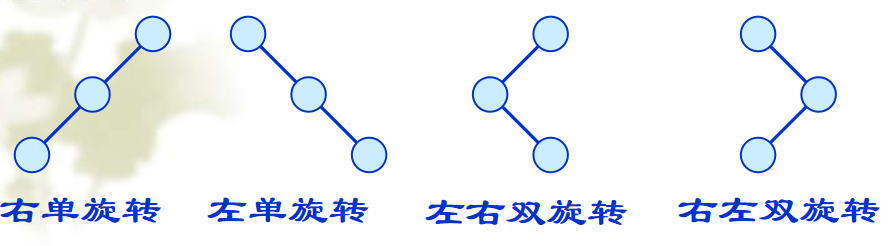
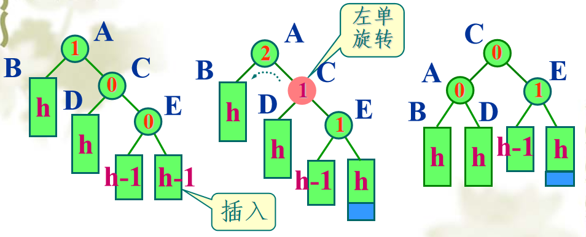
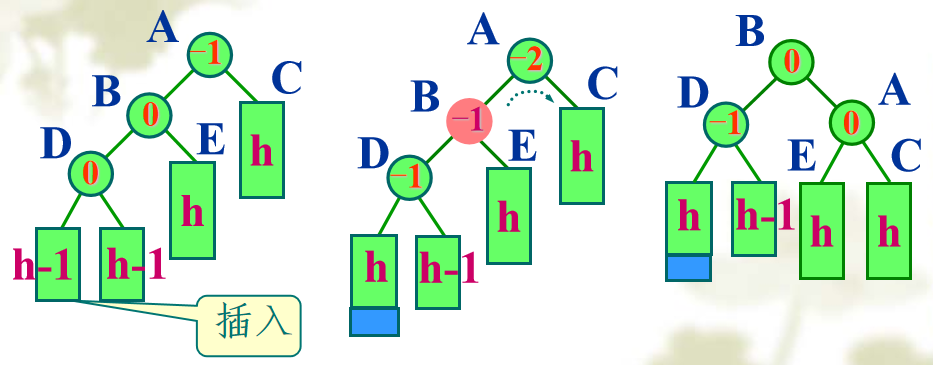
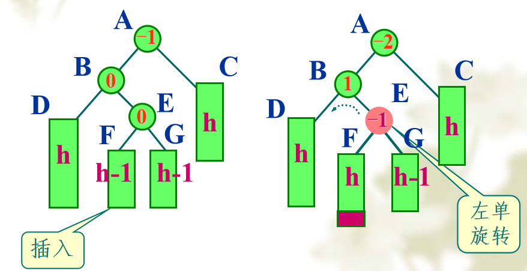
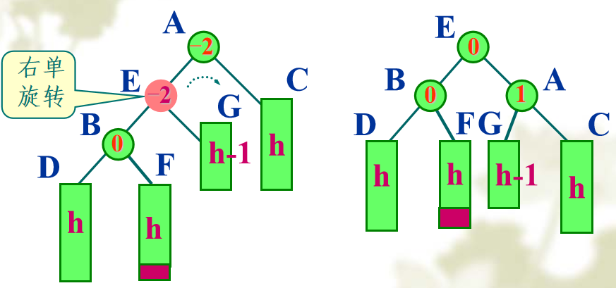

## 静态搜索结构

呃这部分其实在字典那里提前剧透过了，因为想要找到一个键`key`对应的值，其实就是搜索。

### 顺序存储

就是用定长数组来存储元素，在这个定长数组上搜索。

#### 顺序搜索

* 一般的逐个搜索：

不再赘述，复杂度为`O(n)`

* 哨兵法：

呃课件上介绍的一种nt方法😅，就是这样子：

```cpp
int search(const K& k) {
    data[curSize] = k;
    int i = 0;
    for(;data[curSize] != k; i++) ;
    return i+1;
}
```

设置一个哨兵在 `data[curSize] = k`，使得下面循环一定可以停止。而返回值为**实际下标加一**，因此如果**查找失败**返回值为`curSize+1`
> 这吊方法真的大丈夫吗，你能保证 `data[curSize]`不越界吗，而且这种做法有意义吗？😅

* 递归算法

这又是个nt做法：

```cpp
int search(int begin, const K& k) {
    if(begin == curSize) //递归终点 查找失败
        return curSize; 
    if(data[begin] == k) //递归终点 自己查找成功 
        return begin;
    return search(begin + 1, k); //递归子问题
}
```

喜欢写尾递归是吧，就是说不想凑字数可以不凑😅写出这种递归我都觉得害臊。

#### 二分查找
> 下面这东西是我很久之前做的笔记了😄害挺全面，直接搬运嘻嘻🤭

二分的本质就是在**用left，right确定**的**搜索区间**，找其中间mid，并且**用nums[mid]的值进行判断**来确定搜索目标在哪一半，一次砍掉一半来快速找到目标的位置。

* 步骤：

    * 判断是那种类型并确定搜索区间left，right：如果寻找元素**下标**则**闭区间**，如果寻找**边界**则**半开半闭**
    * 写while循环，跳出循环的条件按照类型而定
    * 算mid，并按照nums[mid]和目标的关系来对left或right进行对应的缩进。**需要原创的只有nums[mid]和目标的关系，剩下的只要类型确定了基本定死了**
    * 按照类型return 相应的值
    * 代码框架

  ```C++
  //迭代框架
  int binarySearch(int[] nums, int target)
  {
      int left = 0, right =...;
      while(...)
      {
          int mid = (left + right)/2;//防溢出写成int mid = left + (right - left)/2
          if(nums[mid] == target) ...;
          else if(nums[mid] < target) left = ...;
          else if(nums[mid] > target) right = ...;
      }
      return ...;
  }
  //递归框架
  int binarySearch(int[] nums, int left, int right, int target)
  {
      if(left <= right)//区间不为空
      {
          int mid = left + (right - left)/2;
          if(nums[mid] == taregt) return mid;
          else if(nums[mid] > target) return binarySearch(nums, left, mid-1, taregt);
          else return binarySearch(nums, mid+1, right, target);
      }
      return -1;
  }
  ```

* 寻找一个数下标的二分搜索：**闭区间**

确定好搜索区间为闭区间，因此初始时`left = 0, right = size-1;`，而循环终止条件为`left > right`
  ```C++
  //在正序数组中找target，返回下标，若找不到则返回-1
  int binarySearch(int[] nums, int target)
  {
      int left = 0, right = nums.size()-1;//搜索区间为[left, right]的闭区间
      while(left <= right)//搜索区间为空时终止
      {
          int mid = left + (right - left)/2;//找到元素的话直接返回mid
          if(nums[mid] == target) return mid;
          else if(nums[mid] < target) left = mid + 1;//nums[mid]不是目标
          else if(nums[mid] > target) right = mid - 1;//因此下一步必须将其去除
      }
      return -1;
  }
  ```

* 寻找**左侧边界**的二分搜索：**左闭右开**

返回数组中最左边的`target`元素**下标**。因此对于`data[mid] == target`时，为了找到**更左的边界**，我们让`right = mid`

并且最后**返回值**为`left`或者`right`**都可以**，因为跳出循环的条件就是`left == right`

**corner case**：

实际上这套操作返回的是数组中**最后一个**比 `target`**小的**元素**下标加一**。

因此，如果所有元素都比`target`小，最后的`left`为`curSize`就会越界。

而且也有可能数组中不存在`target`，因此还需要看看最后的`left`到底有无意义。

  ```C++
  //在正序数组中找到最左侧target的下标，如果数组中没有target就返回0
  //即[2,3,5,7] 若target = 1则返回0；若target = 8则返回4；若=5则返回2
  int left_bound(int []nums, int target)
  {
      int left = 0, right = nums.size();//半开半闭区间[left,right)
      while(left < right)//当left==right时[left,right)搜索区间为空 终止
      {
          int mid = left + (right - left)/2;
          if(nums[mid] == target) right = mid;//要左边界因此区间取左侧，缩小搜索区间时必须抛弃mid
          else if(nums[mid] < target) left = mid + 1;
          else if(nums[mid] > target) right = mid;//因为right)等于mid搜索区间也抛弃了mid
      }
      if(left == nums.size()) return -1;//所有元素都比target小则target不在数组中
      return nums[left]==target? left:-1;//左边界确实存在(==)返回下标
  }
  //最后返回left，因为left==right搜索区间为空，所以最后left==right区间为[left,right),都指向target元素
  ```

* 寻找**右侧边界**的二分搜索：**左闭右开**

和寻找左边界类似，为了找到最右的边界，在 `data[mid] == target`时，让区间更右`left = mid + 1`

并且最后**返回值**为`left-1`或者`right-1`**都可以**，因为跳出循环的条件就是`left == right`
> 为什么-1？因为最终nums[mid]==目标的时候又left=mid+1，因此返回target下标再次-1

**corner case**:

这套操作实际上找的是，**第一个**比`target`**大的**元素**下标减一**。

因此若所有元素都比`target`大，则最后的`right`为-1。

若数组中根本没有`target`，则还需要特判一下。

  ```C++
  //[2,5,7,9] 若=2返回0；=5则返回1；=3返回0，若=1则返回-1.
  int right_bound(int []nums, int target)
  {
      int left = 0, right = nums.size();//[left, right)
      while(left != right)//写left<right同理，二者相等时搜索区间为空
      {
          int mid = left + (right - left)/2;
          if(nums[mid] == target) left = mid + 1;//找右边界，且抛弃mid
          else if(nums[mid] < target) left = mid + 1;
          else if(nums[mid] > target) right = mid;
      }
      if(left - 1 == -1) return -1;//最后边界为left-1这是有可能为-1的，说明nums[0]都比target大
      return nums[left-1]==target? left-1:-1;//最后left == right，[left, right)
      //为什么-1？因为最终nums[mid]==目标的时候又left=mid+1，因此返回target下标再次-1
  }
  ```

* 这两个函数可直接用于在有序数组中寻找某一元素的个数（53 
   
直接调用最原始的left_bound和right_bound得到左右边界，然后 `right_bound - left_bound + 1`即可。
> 巧妙的是就算nums中没有target，结果right-left+1返回的总是0。因为right是最后一个比target小的元素下标，而left是第一个>=target的元素下标，因此正好left==right+1，结果为0
  


* 何时使用二分查找？怎么用？

    * 在有序数组中搜索某个给定目标值的索引，目标值的确定不仅仅是原视代码中的==target那么单一，推广到满足某个函数，这样用途就多了起来。

    * eg 1: [koko吃香蕉875](https://leetcode-cn.com/problems/koko-eating-bananas/)

      ```C++
      //显然能够取到的最小速度为1，最大有效速度为max(piles)，我们从小到大穷举1~max(piles)，看哪个最先符合能够吃完，就是最终结果
      //H为最大时间，用于某一速度下吃完时间是否小于H来判断满足
      int minSpeed(vector<int>& piles, int H)
      {
          int max = max(piles);
          for(int speed = 1; speed <= max; i++)
              if(canFinish(piles, speed, H)) return speed;
          return max;
      }
      
      //哪里可以优化呢？在for循环那里，注意到这是在1~max中找一个符合的最小值，满足二分查找的特征：在有序数组中找目标值的索引，而且是满足的最小值，因此是找左边界的二分框架
      int minSpeed(vector<int>& piles, int H)
      {
          int max = max(piles);
          int left = 1, right = max + 1;//因为半开半闭，且区间必须包含1~max的所有数字，因此right==max+1
          while(left != right)//left==right搜索区间为空跳出循环
          {
              int mid = left + (right - left)/2;//防止溢出
              if(canFinish(piles, mid, H)) right = mid;//能完成再缩右侧找到最左边
              else left = mid + 1;//完成不了都缩左侧尝试更大的值
          }
          return left;
      }
      //辅助函数如下
      int max(vector<int>& piles)
      {
          int max = piles[0];
          for(int i=1;i<piles.size();i++)
              if(max < piles[i]) max = piles[i];
          return max;
      }
      bool canFinish(vector<int>& piles, int speed, int H)
      {
          int times = 0;
          for(int i=0;i<piles.size();i++)
              times += (piles[i]/speed) + (piles[i]%speed==0? 0:1);//piles/speed
          if(times <= H) return true;
          return false;
      }
      ```

    * eg 2：[包裹运输问题1011](https://leetcode-cn.com/problems/capacity-to-ship-packages-within-d-days/)

      ```C++
      //还是寻找左侧边界的搜索，最小(左边界)为max(weights)，最大为sum(weights),因此原视搜索区间为[max(weights), sum(weights) + 1)
      //二分框架很简单，重点在于如何验证某一装载量能完成目标
      bool isOK(int size, vector<int> weights, int D)//判断D天能否完成
      {
          int i = 0;
          for(int days=0; days < D; days++)//最多D天
          {
              int each = size;
              while((each -= weights[i]) >= 0)//这个条件表示each减完weights[i]后依然满足
              {
                  i++;//减完后还满足立即i++指向满足后的下一个
                  if(i == weights.size()) return true;//如果i到了数组外size则表示最后一个也满足，i指到了数组外边
              }
          }
          return false;//D天完了还是没有return true
      }
      int solution(vector<int>& weights, int D)
      {
          int left = max(weights), right = sum(weights) + 1;
          while(left != right) //left==right时搜索区间为空
          {
              int mid = left + (right - left)/2;
              if(isOK(mid, weights, D)) right = mid;
              else left = mid + 1;
          }
          return left;
      }
      
      //通过两个例子可以看到，二分搜索可以用于寻找确定区间的最小目标值，一般这种题的暴力解法都是
      for(int i = min; i <= max; i++)
          if(isOK(i)) return i;
      //min和max都是确定好的最大最小的可能，要找最小的目标，用左边界的二分搜索框架
      int left = min, right = max + 1;
      while(left != right)//搜索区间为[left,right)
      {
          int mid = left + (right - left)/2;
          if(isOK(mid)) right = mid;//缩右边界
          else left = mid + 1;
      }
      return left;
      ```

* 性能分析

可以看之前集合和字典那部分的笔记，什么**判定树**之类的玩意，不多说了，反正复杂度是`O(logn)`😄


## 二叉搜索树

其实二分查找的判定树就是一颗二叉搜索树，不过这个判定树由于是从**静态搜索结构**的数组中衍生来的，因此结构是**固定的**。

更一般意义上的二叉搜索树，会根据关键码的**输入顺序不同**得到**不同的结构**，并且在插入删除后**不断调整**，是**动态搜索结构**。

### 概念提出
* 定义

二叉搜索树，是个树，也就是**结点的集合**，因此可以为**空集**，即空树。满足**左子树**所有关键码都**小于**根，**右子树**所有关键码都**大于**根，且左右**子树**也都是二叉搜索树。

* 特点 
  * 每个结点都有一个独一无二的**关键码**，因此二叉搜索树中**不允许出现关键码相同的结点**。 
  * 由于左小右大的特点，二叉搜索树的**中序遍历**，可以得到所有关键码**从小到大排列**，所以也称其为**二叉排序树**。
  
### 实现
就是说二叉搜索树也是个二叉树，纯纯递归完全可以做。但是其实有些不必非得用递归，因为二叉搜索树**左小右大的性质**，递归实际上并**不是盲目**的，我们可以**根据大小关系**找到**一条链表**出来。

那么一些递归操作其实就完全可以用迭代来做了。
> 而二叉树我们有两个孩子，这两个孩子结点可以**是任意的**，也就是我们不知道自己左右子的任何信息，所以我们不得不**对左右子树都进行递归**
> 
> 而二叉搜素树可以通过判断**和根的大小关系**，从而达到**剪枝的效果**。

#### 搜索

递归法就不多说了，这里说一下迭代法吧：
```cpp
template<class T>
BSTNode<T> *BSTree<T>::newSearch(const T &x, BSTNode<T> *root) {
    if(root == nullptr)
        return nullptr;
    auto tmp = root;
    while(tmp) {
        if(x == tmp->data)
            return tmp;
        else if(x < tmp->data) //x比根节点tmp小 在其左子树
            tmp = tmp->left;
        else
            tmp = tmp->right;
    }
    return tmp; //最后的tmp一定为nullptr
}
```
> 二分搜素有递归写法也有迭代写法，就是一条**从根到叶的路径**，不涉及回头，怎么一看见树就只想着递归呢？😅

可以看到，搜索过程是从根结点开始，沿**某条路径自上而下逐层比较判等**的过程。因此**复杂度就是树高**，即`O(logn)`

#### 插入新结点

二叉搜索树中**不允许关键码重复**，因此插入前**先搜索**是否已经存在这个键，如果存在则返回`false`，否则再进行插入操作。

呃原始版本比较丑，是先调用`Search`函数寻找，然后再去插入。事实上插入的过程可以**包含搜索操作**，**一次递归就搞定**。
> 而且如果是**空树**，也就是`root==nullptr`时，这个插入就有bug了

由于要得到**新的叶结点**，因此必须知道**叶结点的父结点**，如果按照**传值**的方式不得不将**递归终点**设置为`!root->left && elem < root->data`这样子，非常丑。

换成**传引用**优雅太多😋
```cpp
template<class T>
bool BSTree<T>::newInsert(const T &elem, BSTNode<T> *&root) {
    if(root == nullptr) { //到达叶结点 由于引用直接修改其本身
        root = new BSTNode<T>(elem);
        return true;
    }
    if(elem == root->data) //已经存在了
        return false;
    else if(elem < root->data) { //应该插入root的左子树
        return newInsert(elem, root->left);
    }
    else { //应该插入root的右子树
        return newInsert(elem, root->right);
    }
}
```
> 插入的新结点一定是将树底部的一个nullptr变成了**叶结点**
> 
> 我承认这次课件的实现写的比较漂亮，是我引用学的不够精😋对不起我忏悔


#### 二叉搜素树的建立

二叉树的建立**不断插入**新结点即可实现。当然需要规定**输入结束**的符号，初始时`root==nullptr`。

上面的`newInsert`可以正确**在空树**插入**第一个结点**，因此只需要下面这样即可：
```cpp
template<class T>
BSTree<T>::BSTree(T end) {
    T tmp;
    while(true) {
        cin >> tmp;
        if(tmp == end)
            break;
        Insert(tmp, root);
    }
}
```

#### 删除结点

删除结点后要保证二叉搜索树的**结构不被破坏**，因此不同情况有不同的处理方式：
* 该结点为叶结点，**直接删**
* 该结点只有左子树，则让左子树**直接取代它**的位置
* 该结点只有右子树，则让右子树**直接取代它**的位置

上面三种情况都非常好理解，重点是：该结点左右子树**都不为空**，那么为了保证**删掉它之后**仍然是二叉搜索树，我们约定：让该结点的**右子树中序下的第一个结点**取代其位置。
> 当然我们也可以约定让该结点**左子树中序下最后一个结点**来取代它

哈哈梦回**中序线索树**了属于是😄因为二叉搜索树的中序遍历就是所有结点的升序。那我们就只关注**右子树下中序的第一个结点**吧.

有两种情况，一种**就是叶结点**；另一种不是叶结点，但**左子树为空**，**右子树不为空**
> 毕竟左中右嘛，左优先，递归时终点为 `if(root->left == nullptr) return root;`

同样两种处理方式：叶结点可以**直接取代**；不是叶结点则需要让其**父结点左指针**指向**自己的右子树**。

这里实现同样很巧妙，就是说**引用指针参数**真的神中神🤭
```cpp
bool Remove(const T &x, BSTNode<T> *&root) { //root为引用参数
    if(root == nullptr) //defensive
        return false;
    if(root->data == x) { //需要删除root
        if(root->left && root->right) { //左右子树都不空
            auto it = root->right;
            while(it->left) it = it->left; //it为root右子树中序下第一个结点
            root = it;  //这就是神中神的地方 直接把root覆盖掉
            return Remove(it->data, root->right);
        }
        else { //至少一个子树为空
            auto tmp = root;
            if(!root->left)
                root = root->right;
            else
                root = root->left;
            delete tmp; //实际删除结点的地方
            return true;
        }
    }
    else if(x < root->data) 
        return Remove(x, root->left);
    else 
        return Remove(x, root->right);
}
```
**传引用**为什么是神？有两处：
* 左右子树都不为空时，找到右子树中序下第一个结点，然后通过 `root->data = it->data`**覆盖**掉`root`结点的**值**，之后的`Remove(it->data, root->right)`才是神中神
> 就是说这里的 `root->data = it->data`**值覆盖**并没有**实际删除结点**，而是把**问题规模缩小**到右子树里了。
* 最终**实际删除结点**，就是不断递归到删右子树**中序下第一个结点**那里，情况分两种：**叶结点**或者**左空右不空**

正是语句`root = root->left;`体现了**传引用的神**，若右子树非空则直接让**其本身变成右子树**，为空则让自己**变成空**，完美解决问题🤭
> 改变自己后原来的地址就**丢了**，因此需要用`tmp`记录下来原地址，释放原本的结点内存

#### 其他操作

什么输出，置空和二叉树一模一样，输出我用的是层序遍历，不赘述了就是说😋


## 平衡二叉搜索树

### 概念提出

二叉树要想保持`O(logn)`的复杂度，不得不维持高度平衡。

* 平衡因子`balance factor`：该结点**右子树**高度减去**左子树**高度。对于AVL树，**任意结点**的平衡因子只能为`-1, 0, 1`
> 也就是说，任意结点左右子树的高度相差**不能超过一**

如果满足高度平衡，那这个二叉树**实际使用**起来**性能**才能有所保证。不然很有可能**退化成单链表**，复杂度就成`O(n)`了。

下面看看如何实现AVL树，引入新的操作：**平衡化旋转**。

### 平衡化旋转

如果在一个**平衡的**二叉树中**插入新**的结点，造成了不平衡，那么需要**调整到平衡**。我们约定了一种较好的**调整方式**，也就是**平衡化旋转**。

具体流程为：
* 首先按照**原始的**二叉树结点插入**方式**插入到AVL树中，然后沿插入位置沿**通向根的路径回溯**，检查**各结点的平衡因子**
* 发现结点**不平衡则停止**回溯，从**发生不平衡的结点起**，**沿刚才回溯的路径**取**直接下两层**的结点。
* 如果这三个结点处于**一条直线**上，则采用**单旋转**进行平衡化。单旋转可按其方向分为**左单旋转**和**右单旋转**，其中一个是另一个的镜像，其方向与不平衡的形状相关。
* 如果这三个结点处于**一条折线**上，则采用**双旋转**进行平衡化。双旋转分为**先左后右**和**先右后左**两类。

如下图：



下面依次介绍每种旋转情景。

#### 左单旋转
场景如下，插入新结点后**向上回溯检查平衡**，发现不平衡则立刻**停止回溯**，沿回溯路径取**直接下两层**结点，发现在**同一条直线**上，对**这三个结点**左单旋转。

为使树恢复平衡，从A沿插入路径连续取3个结点A、C和E，以结点C为**旋转轴**，让结点A**反时针**旋转。



代码实现时，参数`root`即为三层结点**最上的一层**，也就是**旋转轴点C**，即**最先发生不平衡**的**那个结点**。可以看到经过左旋之后，`root`成为**新的根的左子树**。

具体如下，配合图片观察：
```cpp
template<class T>
void AVLTree<T>::RotateL(AVLNode<T> *&root) {
    auto subL = root; //root最终成为新根的左子树
    root = root->right; //左旋转
    subL->right = root->left;
    root->left = subL;
    root->bf = subL->bf = 0;
}
```

#### 右单旋转

插入结点后导致某个结点的**左子树过高**，这时需要**右单旋转**，为使树恢复平衡，从A沿插入路径连续取3个结点A、B和D，以结点B为**旋转轴**，将结点A**顺时针**旋转。

如下图所示：


实现时参数 `root`为图中的**旋转轴点B**，即最先看到的不平衡的结点，最终旋转轴B成为**新根的右子树**：

```cpp
template<class T>
void AVLTree<T>::RotateR(AVLNode<T> *&root) {
    auto subR = root; //root最终成为新根的右子树
    root = root->left;
    subR->left = root->right;
    root->right = subR;
    root->bf = subR->bf = 0;
}
```

#### 先左后右双旋转

向上回溯发现不平衡结点后，**沿回溯路径**取**直接下两层**结点，三个结点构成**折线**，则需要**双旋转**。

这里呈 `<`形状的，先左单旋转，再右单旋转。

场景如下：插入结点到A的左子树，A的平衡因子由-1变为-2，需要旋转调整：

* 先按照**旋转轴点B**左旋转，也就是 `<`的那个尖尖🤭



* 再按照**旋转轴点A**右旋转，也就是 `<`**右上角**的那个点：



代码实现如下，最开始的参数`root`就是`<`**右上角**的那个点，也就是**最先发生不平衡**的地方：

```cpp
//先左单旋转再右单旋转 root初始为 '<' 的右上角
template<class T>
void AVLTree<T>::RotateLR(AVLNode<T> *&root) {
    //先左单旋转
    auto tmp = root->left; //tmp指向<的尖尖 即将被<的右下角代替
    root->left = root->left->right;
    tmp->right = root->left->left; //原来的尖尖 的右子树指向原来<右下角的左子树
    root->left->left = tmp;

    //再右单旋转
    auto subR = root; //最后的root变成新根的右子树
    root = root->left;
    subR->left = root->right;
    root->right = subR;
}
```

### AVL树的插入

### AVL树的删除


😭没写完就是说，wdnm上课光讲了个理论，根本没细讲代码。不想看了mmd

* 单旋转和双旋转麻烦的是维护**每个结点的平衡因子**，这个我暂时还没搞清楚。

* 然后AVL的插入和删除，插入其实就包含**构建**了，基础操作都和二叉搜索树没区别，主要是**调整平衡**用代码不太好实现😭。

> mmd不看了，好烦好烦好烦啊😭这班上的学生是不会上网吗，mmd就知道张口问，搭伙的那个助教又在装死wdnmd