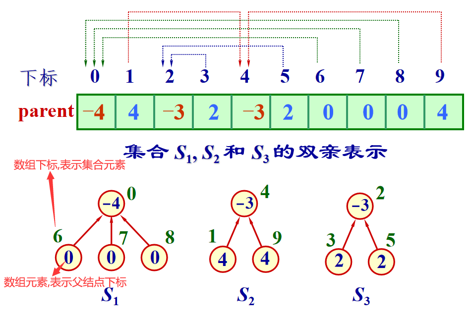
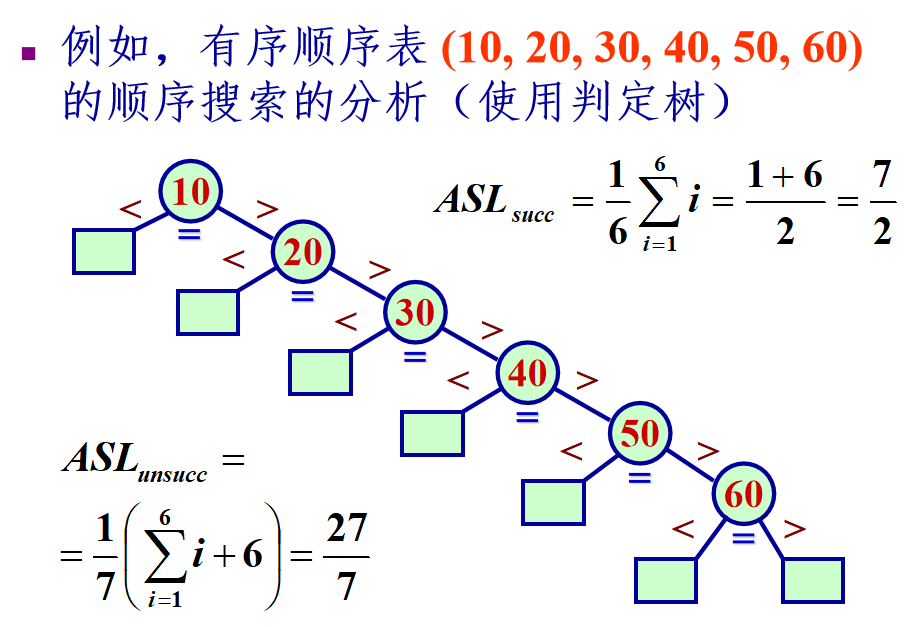
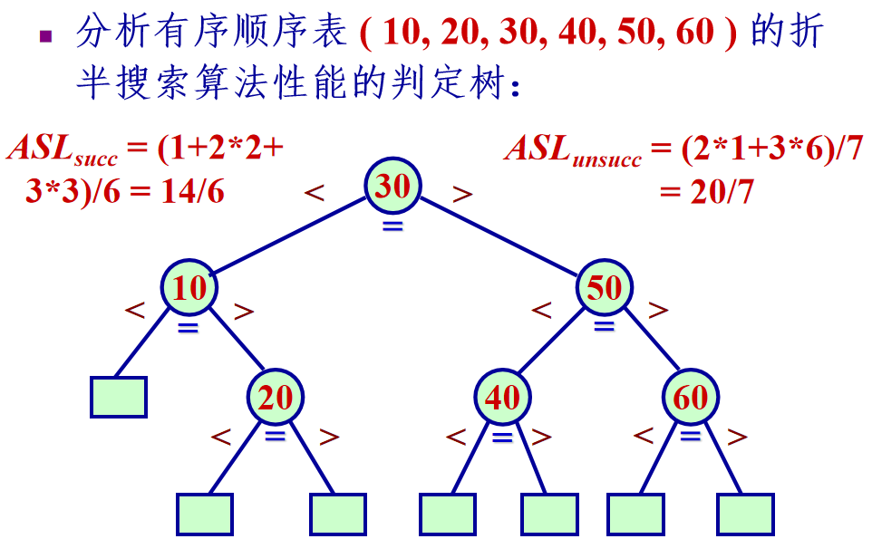
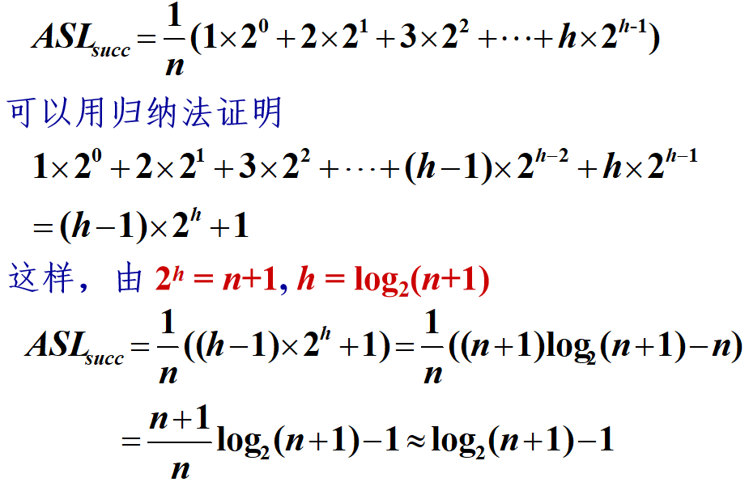

## 集合
集合感觉没啥好讲的，主要的操作就是求交集、差、并集等操作。

### 实现
课件只简单介绍了两种实现，简单说一下吧。
> 课件都懒得写实现光给了个接口，下面讲的两种实现在课本上有，我懒得写了就是说😭
> 
> 我觉得还是多多关注并查集和字典那些吧。。。


* 用位向量实现

给定**全集的元素种类数n**，然后用大小为n的数组A表示，当 `A[i] == 1`表示该元素存在在集合中，当`A[i] == 0`表示该元素不在集合中。

那么求两个集合的交并差，只需要扫描位向量，**模拟位运算**那样子就可以了。

* 用有序链表实现

位向量的话需要保证全集元素**种类数有限**，从而给出一个固定大小的**位向量**。但是如果元素种类非常多的话，那就得用链表了。

为了让集合操作更容易实现，需要**维护链表有序**。在求集合的交并差时，就是**双指针**扫描两个链表，并**创建一个新链表**存储最终结果。

> 两个**有序**链表上的双指针，感觉挺典中典的，突然联想到**归并排序**，呃呃好像这里的集合求并和**链式**归并排序很像😄
> 
> 不过集合求交的话值相等的结点**只保留一份**，因此求交的话对于相等的结点需要特殊处理一下，两个指针应该**同时进一**，像下面这样：
> ```cpp
> if(pa->data == pb->data) { //pa pb就是待求并的两个链表指针
>    res->next = new Node(pa->data);    //存到结果链表res中
>    res = res->next;
>    pa = pa->next;  pb = pb->next; //两个指针同时进一，达到只保留一份的效果
> }
> ```
> 
> 之后再细看实现吧，太懒了😔


## 等价类与并查集

最直接的，等价类是**数学上的**概念，而**并查集**则是等价类的一种**代码实现**。

### 基本概念
* 等价关系：如果一个**二元关系**a，满足自反、对称、传递，则称关系a为等价关系。 
> 梦回离散，显然等于"="关系是等价关系。
* 等价类：将一个集合S中的所有对象**按照等价关系划分**，可以分成若干个**互不相交的子集**，这些**子集的并等于全集**，每个子集就是一个**等价类**。

### 用并查集实现等价类

也就是**父指针数组**，

在实际解决问题中，常常会遇到等价类的问题，那么如何**用代码实现等价类**？答案是并查集。

使用时，首先需要确定**全集**中元素的个数n，然后开辟大小为n的数组，数组下标 `0~n-1`表示n个元素，而`A[i]`则为元素`i`的父结点下标，**每个**集合为**一颗树**。

根结点的`A[i]`为该集合元素个数的**负数**，一般根结点下标代表该集合的**名字**，**初始时**，每个`A[i]==-1`，表示每个结点单独为一棵树，即一个集合，且集合里只有**自己一个**元素。

大致长这样：



> 逻辑上就是一颗树，通过数组表示，每个数组元素表示该元素的**父结点下标**。

并查集 `Union-Find Set`，涉及到两种操作：并和查。

* 查操作：查一个结点的**根结点**，也就是所谓**集合名**，并且进行**路径压缩**

不断循环找到 `A[i] < 0`就说明找到根了。


* 并操作：合并两个结点**所在的集合**，将结点少的根附加到结点多的根上

  * 合并时首先要找到两个结点**所在集合**，即根结点，然后**合并根**结点。
  * 为什么要把**结点少**的集合的根附加到**结点多**的集合的根上？因为附加就会使得层数变深，我们要尽可能**让层数深的结点少一些**。
  
  
* 实际使用：

上面的实现**集合元素**只是**数组下标**，也就是只用上面的实现的话，集合元素只能表示为 `0~n-1`这n个**数字**而已。

集合的元素是多种多样的，因此确定元素个数n后，需要**让每个元素和一个数组下标绑定**。
> 也就是一个map映射啦😄 怎么可能会有集合元素正正好好就是数字 `0~n-1`这种情况的🤭

实现见 `Set/UFSets.h`文件中。

## 字典

对于集合的交并差除了特殊场景外用处不多，并查集稍微多一点。
> 不过并查集和传统意义上的集合基本没啥关系了就是说🤭父指针数组形成的树形结构，完完全全就是两种概念，而且是用于等价类划分的

呃更常用的是**键值对的集合**，也就是字典，并且要支持通过键**唯一表示**值，以及相应的**通过键**的**增删查改**那一套。

一般我们说的字典的**键是唯一**的，但拓展的字典允许键出现重复，这时候需要**指定**搜索或删除关键码返回的键值对的**规则**。

### 字典的实现
有三种实现方式：
* 基于线性表：线性表又有顺序存储和链式存储
> 因而就有了对于搜索的优化：比如顺序存储的二分查找，或者链式存储可以构件二叉搜索树的结构
* 基于跳表：不介绍，上课都没讲过，看来不重要🤭
* 基于散列表
> 用hash的方式使得**搜索复杂度**降到**线性级别**，神中神

为了更好的性能，比如可以二分查找，不管是顺序存储还是链式存储，我们都维护**键升序排列**。

#### 有序线性表

设字典中共有n个键值对，则搜索时，最基本的方式：一个个**顺序搜索**，碰到比 `key`大的元素说明该字典**一定没有**这个键，代码如下：

```cpp
for(int i = 0; i < size; i++)
    if(data[i] == key)
        return i;
    if(data[i] > key) //数组升序 可以保证数组中没有这个元素
        return -1;
return -1;
```

可以用**平均搜索长度ASL**(Averge Search Length)刻画搜索算法的效率，设搜索第i个元素的概率为`pi`，搜索结束(**成功/失败**)需要的**比较次数**为`ci`，则：
`ASL = SUM(Pi*Ci)`，其中`SUM(Pi) = 1`。

相应的ASL分成两种：**搜索成功**的ASL和搜索失败的ASL，显然顺序搜索中：

* 有n个元素，则每个元素的 `Pi = 1/n`，则`ASL_success = (1+2+...+n)/n = (1+n)/2`

* 而n个元素使失败的情况有**n+1**个区间，我们**简单粗暴**认为落到每个失败区间的概率都为`1/(n+1)`，则 `ASL_fail = (1+2+...+n+n)/(n+1) = n/2+n/(n+1)`。

课件上还给了**判定树**方法来展示，搜索成功时停在内结点，失败时停在外结点，如图：
> 外结点也就是**叶结点**，hhh这个内外结点第一次还是在霍夫曼树最优二叉树那里，内外路径的概念提出来的😄



注意**搜索失败**情况下，**落在**最后一个结点**之前**的区间和**之后**的区间，**比较次数都是n**。

可以看到，顺序搜索的时间代价为 `O(n)`

当然更好的方法是**二分查找**，复杂度为 `O(logn)`
```cpp
int l = 0, r = size;
while(l < r) { //左闭右开区间[) 因此结束条件为l == r
    int mid = l+(r-l)/2; //防止溢出
    if(data[mid] == key) 
        return mid;
    else if(data[mid] > key)
        r = mid;
    else
        l = mid + 1;
}
return -1; //没有找到返回-1
```
当然同样可以用**判定树**来展示：



> 我超这不就是个二叉搜索树吗，什么世界线收束🤣只不过它的构造方式是**不断将数组折半**来进行的
> 
> 这是个递归的过程，找 `data[mid]`**作为根**，然后左右两侧**递归构造**即可。

搜索性能分析：



#### 有序链表

如果是有序单链表的话，就没办法用二分搜索这种操作了，只能老老实实一个一个比较。

**性能同顺序存储的顺序搜索法**，实现以及分析很简单，在线性表那节详细讲过，这里就不赘述了。


## 哈希/散列表

### 概念提出

上面两种字典都是**基于线性表**实现的，搜索时需要**不断比较**来寻找键值对，即便用二分搜素也换汤不换药，复杂度也不过是`O(logn)`，而且还得小心**维护结构的有序**性。

有没有一种数据结构，搜索时复杂度为 `O(1)`，根本就**不比较**，用**映射**的方式直接获得给定元素的实际**存储位置**，这就是**哈希表**。

对于一个`key`，通过 `hash(key)`得到元素`key`的实际存储位置，之后也用同样的方式访问，**设计维护哈希函数**是关键。

* 哈希表

通过 `hash(key)`得到的数字就是键为`key`的元素在**哈希表中的下标**，也就是最终实际存储元素的**数组**。因此如果哈希表大小为n，那么在其上的哈希函数应该保证**值域在`0~n-1`内**。

哈希函数无法映射到的下标值，比如哈希表大小为10，但是哈希函数为 `hash(key)=key%8`，那么下标`8, 9, 10`一般都用来**解决哈希冲突**。


### 哈希函数

如果**不同的**`key`的哈希值**相等**，也就是映射到了同一个位置上，这就叫做**哈希冲突**。**理想的**哈希函数需要满足：

* **计算简单**，且地址**分布均匀**，冲突尽量少
> 如果计算很复杂的话那就得不偿失了，因为我们想要根据键**快速得到**存储位置
* 对于冲突有完备的解决方案

下面介绍几个**典中典的哈希函数**：

* **直接定址**：

有多少个元素，哈希表就多大，哈希函数自己手动编写。比如把 `12, 25, 77, 4`这几个数字**使用并查集**时，由于并查集的下标只能`0~n-1`，因此可以手动写哈希函数，给每个元素**唯一绑定**`0~n-1`上的一个值。

从元素本身到并查集内部的映射：
```cpp
int hash(int key) {
    switch(key) {
        case 12: return 0;
        case 25: return 1;
        case 77: return 2;
        case 4:  return 3;
    }
}
```
这样如果要合并12和77两个等价类，进行操作 `Union(hash(12), hash(77));`即可。
> 也就是给每个元素一个在并查集内部的**下标号**，这是**一一对应**的，因此更完整的是建立双射

从并查集内部到元素本身的映射：
```cpp
int dehash(int index) {
    switch(index) {
        case 0: return 12;
        case 1: return 25;
        case 2: return 77;
        case 3: return 4;
    }
}
```
这样求某个元素的所在等价类名时：`Find(hash(12));`返回的是**并查集内部的下标**，需要再次取`hash`。
> 当然这些工作完全可以直接写在并查集**实现的内部**，不过这样的话就需要在 `Union`和 `Find`内部调用哈希函数了，因此需要增加成员函数`hash`

* **求余法**：

若**哈希表大小**为n，则取**不大于n**的**最接近**的**质数p**，并定义哈希函数为 `hash(key) = key % p`。

> 为什么要小于等于n，而不直接就是 `key%n`？
> 
> 因为多余的空位置来解决可能出现的哈希冲突
> 
> 为什么非要质数？而不是2的幂，10的幂这样更规整的数字？
> 
> 因为如果取2的幂，10的幂的话，那么 `key%(2^i)`或者 `key%(10^i)`就是取每个数在二进制/十进制下的**低i位**，这样**哈希值集中出现**，会导致**更多冲突**的可能性

* 其他方法：

什么数字分析法，折叠法和平方取中法，我不想多说了，懒得看了😭

### 冲突处理

#### 开散列法
> 课本最前面还提了个桶方法，就是把映射到同一位置的元素放到**同一个桶里**，这里是放到链表里，思路是一样的，不过链表是**无限**的而桶有限。

散列表里存的不再直接是元素，而是一个个**元素的链表**，每个链表存储所有**哈希到这里的元素**。

寻找的时候**在链表上遍历**，因为**链表是无限**的，所以这种方法可以说是**顺序搜索和哈希的混合体**了，一种不那么漂亮的方法。
> 如果元素太多的话**链表很长**，就真退化成顺序搜索了😅
> 
> 不过我觉得够用了，毕竟下面的闭散列法**一次找不到**还不是得**一个个比**？起码线性探查看不出来优越性，

假设哈希表大小为m，有n个元素，则每个链表长度为 `n/m`，那么搜索复杂度为 `O(n/m)`，比`O(n)`还是快不少的。

#### 闭散列法

存放`key`时，`hash(key)`之后发现对应位置上已经**被别人存了**，也就是冲突了，那么就得在后面**找个空桶**存进去。

之后使用该`key`时，找`data[hash(key)]`发现这个位置上不是自己，用和**找空桶同样的方法**，向后找，一个个**找**一个个**比较**:

找到自己则成功了，如果找到一个**空位置**则查找**失败**了。

* 线性探查法

找空桶时，**一个个**往后找， 需要搜索或加入一个表项时, 使用散列函数计算关键字在表中的位置：

`H0 = hash(key)` 一旦**发生冲突**，在表中**顺次向后**寻找**下一个**位置`Hi = (H{i-1} + 1) % n`其中`i = 1, 2, …, n-1`

> 可以看到，**闭散列法**哈希表是组织成**环形结构**的，即有`%m`

* 二次探查法

不多说了，课本上有，课件没有，说明不重要嘻嘻🤭