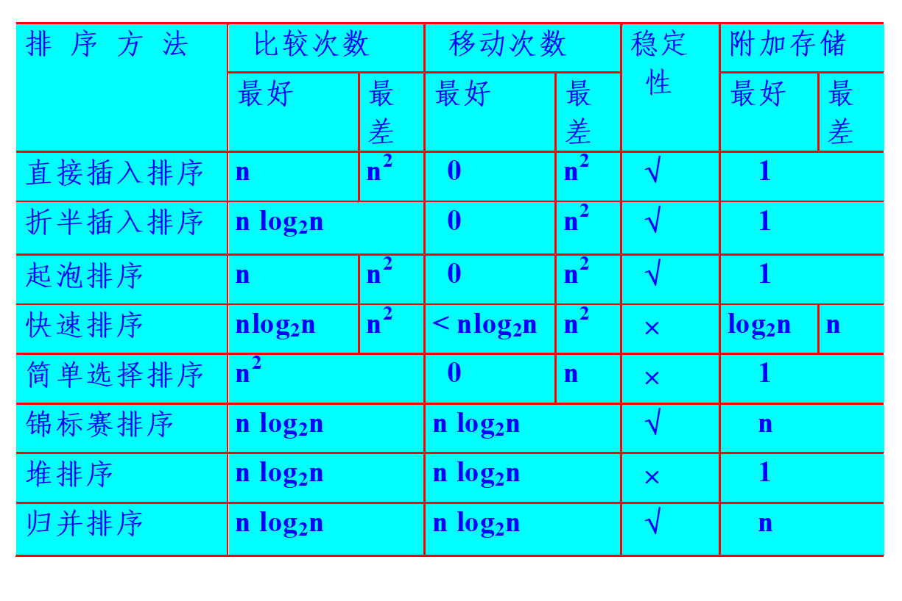

## 排序

### 基本概念

* 排序算法的稳定性：如果初始数组中值有相同的数a和b，a在b前面，使用某种排序算法排序后，若a**保证**还在b前面，则**称**这种排序算法是稳定的，否则就是不稳定的
* 内排序和外排序：
    * 内排序是指在排序期间内**数据全部放在内存中**的排序；
    * 而外排序是指在排序时元素太多内存无法容纳，不能同时放在内存，必须根据排序的要求不断在内、外存之间移动的排序
* 评价算法的标准：
    * 一般看**平均情况**下的数据**比较次数**和数据**移动次数**
    * 对于受初始排列顺序影响较大的算法还要给出**最好**和**最差**情况下的复杂度，比如冒泡排序最好就是`O(n)`，平均为`O(n^2)`

### 排序算法分类

虽然排序算法有很多种，但是可以分成两个大类：内部排序和外部排序。

我们大部分讨论的都是内部排序，其中又可以细分为：

* 插入排序
    * 直接插入排序
    * 折半插入排序
    * 希尔排序
* 交换排序
    * 冒泡排序
    * 快速排序
* 选择排序
    * 简单选择排序
    * 堆排序
* 归并排序和基数排序

而外部排序课主要有：

* 多路归并与败者树
* 置换-选择排序
* 最佳归并树

下面依次介绍这些算法，重点不仅是算法的步骤，以及复杂度和算法之间的比较

### 插入排序

整体思路就是把新的数据插入到**已经排好序**的数组中重新排序，直到把所有数据插完则结束，比如把`a[i]`插入到已经排好序的`a[0~i-1]`中

#### 直接插入排序(Insert Sort)

将`a[i]`插入到前i个元素时一个个比较，碰见比自己大的则交换，直到碰见比自己小的则插入成功，总共插n-1次。

算法实现如下：

```cpp
void InsertSort(int *a, int n) {
    for (int i = 1; i < n; i++) { // 插入元素a[i]到已排序的a[0~i-1]中
        int each = a[i], j;
        for (j = i - 1; j >= 0; j--) {
            if (a[j] > each) { // 比a[i]大的向后移动
                a[j + 1] = a[j];
            } else { // a[j]<=a[i] 找到了插入位置
                a[j + 1] = each;
                break;
            }
        }
        if(j < 0) // 最后j<0说明应该插到a[0]位置
            a[0] = each;
    }
}
```

显然插入n-1个元素没法省，每插一个元素，最坏情况下（完全逆序）需要比较i次，移动i次，复杂度为 `O(n^2)`。

最好情况下，原数组就是排好序的，那么每插一个元素时只需比较一次，不移动元素，复杂度为`O(n)`

平均情况复杂度也为`O(n^2)`。

直接插入排序是**稳定的**排序算法，因为从后往前插，当发现`a[j] <= a[i]`时则结束本次插入，也就是原本在前面的`a[j]`还在前面

#### 折半插入排序(Binary InsertSort)

由于插入`a[i]`时前i个元素已经有序了，可以用**二分法找到该插入的位置**不必挨个比较

找插入的位置时，其实是寻找`a[i]`在有序数组中`a[0~i-1]`中的**右边界**，即第一个大于`a[i]`的数组下标**作为要插入的位置**，之前的元素都比`a[i]`小

算法实现如下：

```cpp
void BinaryInsertSort(int *a, int n) {
    for (int i = 1; i < n; i++) { // 插入a[i]元素到已排序的a[0~i-1]中
        int left = 0, right = i, each = a[i];
        while (left < right) { // 为了保证稳定性 在a[0~i-1]中寻找a[i]的右边界
            int mid = left + (right - left) / 2;
            if (a[mid] <= each) {
                left = mid + 1;
            } else {
                right = mid;
            }
        }
        for (int k = i; k >= right + 1; k--) // 空出right的位置
            a[k] = a[k - 1];
        a[right] = each; // right为第一个比a[i]大的元素下标 之前的都比a[i]小 因此插到right这里
    }
}
```

折半搜索比顺序搜索快，因此平均性能折半插入要比直接插入好。

但是折半插入复杂度和数组初始排列无关了，因为每插入新元素都要`O(logi)`复杂度寻找插入位置。实际的复杂度为`O(nlogn)`
> 因此在最坏情况下，折半插入要比直接插入性能好，但是最好情况下，直接插入复杂度可以到`O(n)`，折半插入却吃不到任何好处

折半插入排序是**稳定的**排序算法。

#### 希尔排序(Shell Sort)

如何利用**直接插入*排序在**最好情况下的优势**？即如果数组**基本有序**，那么直接插入的性能是非常好的。

这就是希尔排序，抓出了直接选择排序在数据量不大并且基本有序时的性能优势，把待排序的数组划分成`gap`个较小的“子表”，各元素间隔为固定值`gap`。
> 每个子表形如`L[i, i+gap, i+2*gap, i+3*gap...]`，确定的**增量**`gap`将整个数组划分成`gap`个子表

在每个子表内进行**直接选择排序**，然后**逐步缩小**`gap`，当`gap==1`时就是初始数组。

因此希尔排序也叫**缩小增量排序**。

算法实现如下：

```cpp
void ShellSort(int *nums, int n) {
    for (int gap = n / 2; gap >= 1; gap /= 2) {
        for (int i = gap; i < n; i++) {
            int tmp = nums[i], j; //a[i]每一子表中直接插入的元素
            for (j = i - gap; j >= 0; j -= gap) {
                if (tmp < nums[j]) { //在该子表中后移
                    nums[j + gap] = nums[j];
                } else { //a[i]在该子表中找到了插入位置
                    nums[j + gap] = tmp;
                    break;
                }
            }
            if (j < 0) nums[i % gap] = tmp; //j<0说明应该插到该子表的0号位置
        }
    }
}
```

初始的gap = n/2，也就是一开始每个子表只有2个元素，第一个子表的元素下标为`0, gap, 2*gap...`，第二个子表元素下标为`1, gap+1, 2*gap+1...`

之后gap /= 2每一轮子表大小变成原来2被，最后gap=1，变成原始数组大小。

在每个子表中使用**直接插入排序**，从**每个子表**的**第二个**元素开始插入，即**初始的i为gap**，通过i-=gap来找**该子表的前一个**元素。

> 增量gap的取法有很多，这里的初始gap = n/2，迭代时每次gap /= 2 是**最初**希尔提出的方案。

希尔排序的复杂度难以衡量，在某个特定区间内复杂度可以达到`O(n^1.3)`已经很不错了就是说，最坏情况下复杂度为`O(n^2)`

希尔排序是**不稳定的**排序算法，因为很有可能把**值相同的元素划分到不同的子表**，导致前后顺序改变，并且希尔排序**只能用于数组**，因为要通过`nums[i-gap]`下标索引。

### 交换排序(Exchange Sort)

基本思路是就是**消除逆序对**，**两两比较**待排序的元素，如果这是个**逆序对**，**则交换**这两个元素，直到数组中没有逆序对则排序成功。

#### 冒泡排序(Bubble Sort)

每次比较**相邻的**两个元素，如果为逆序则交换，第i轮将把前n-i个元素的最大值**起泡到最后**，因此一共需要起n-1轮泡。

如果某一轮起泡没有发生任何交换，即无逆序对了，则可以直接结束算法，即最好情况下复杂度为`O(n)`。

算法实现如下：

```cpp
void BubbleSort(int *nums, int n) {
    for (int i = 0; i < n - 1; i++) { //第i轮起泡
        int flag = false;
        for (int j = 1; j < n - i; j++) {
            if (nums[j] < nums[j - 1]) { // 发现逆序对
                flag = true;
                int tmp = nums[j];
                nums[j] = nums[j - 1];
                nums[j - 1] = tmp;
            }
        }
        if (!flag) // 没有发现逆序对则排序完成
            return;
    }
}
```

空间复杂度为`O(1)`，时间复杂度在最好情况下为`O(n)`，最差情况下，完全逆序，需要起泡n-1趟，一共比较`(n-1 + 1)*(n-1)/2 = n(n-1)/2`次。

每比较一次做一次交换，而每次交换代价为3，总代价为`3n(n-1)/2`。因此复杂度为`O(n^2)`。

冒泡排序是**稳定的**排序算法，因为两个值相同的元素不是逆序对，不会进行交换。

#### 快速排序(Quick Sort)

我们直到交换排序的思路就是通过交换来**消除逆序对**，冒泡排序之所以低效，是因为每次比较**相邻**的两个元素，因为**相邻导致每次交换只能消除一个逆序对**！

而快速排序就是为了让一次交换可以消除多个逆序对，即大的元素尽量往后放，小的元素尽量往前方。设置基准`pivot`元素，将数组划分成两个子树组，坐标都比`pivot`小，右边都比`pivot`大。

算法实现如下：

```cpp
void QuickSort(int *nums, int left, int right) {
    int pivot = nums[left], low = left, high = right;
    while(low < high) {
        while(low < high && nums[high] >= pivot) right--;
        nums[low] = nums[high];   // right指向比pivot小的元素 放到左边
        while(low < right && nums[low] <= pivot) left++;
        nums[high] = nums[low]; // left指向比pivot大的元素 放到右边
    }
    nums[low] = pivot; //最终low==right 即pivot应该放的位置
    QuickSort(nums, left, low-1);
    QuickSort(nums, low+1, right);
}
```

快排的partition划分操作有很多种不同的实现，这里是最方便理解的一种。
> 好像是严蔚敏教材的方法

每次用当前区间内**第一个**元素`nums[left]`作为pivot，因此**紧接着**必须**先**从右到左`right--`找到比pivot小的元素**覆盖掉nums[left]**。
> 将nums[left]覆盖掉，那么之后的操作该区间内**始终有个空位置**，便于寻找最终pivot的位置。

最终left == right时停止，可以保证此时的nums[left]已经在上一步移到别的位置了，这个位置就是最终pivot的位置。

* 复杂度分析

每次partition都需要从两头right和left开始将所有元素都和pivot比较一般，因此每次partition代价为`O(n)`.

复杂度递归式为`A(n) = 2A(n/2)+O(n)`，由Master定理可知复杂度为`O(nlogn)`

但是这是理想情况下每次都能**均匀划分**成两个左右子数组，即`2A(n/2)`，**最坏情况下**划分极度不平衡，每次规模只能-1，即`A(n)=A(n-1)+O(n)`，则复杂度退化为`O(n^2)`

* 稳定性

快速排序是**不稳定的**排序算法，比如划分后右数组有两个值相同的元素a和b，a在b前面，但是从右到左b**先被换到**left处，导致partition后b反而在a前面，因此不稳定。

* 适用情况

对于数组**规模较大**的**平均情况**下，快排的表现比较好；但是数组**规模较小**时，比如只有5~25个元素时，**直接插入**反而比快排更快。

因此有种**改进方式**就是，**划分后**的子数组规模比较小时，**不再递归**而是直接插入排序。

### 选择排序

选择排序的基本思想是：每一轮比如第i轮**选择后n-i个元素中最小的元素**放在位置i上，这样最后在2个元素中选后算法就能结束了。

#### 直接选择排序(Select Sort)

每次都在nums[i]到nums[n-1]中选最小的元素，**交换到**nums[i]上。

算法实现如下：

```cpp
void SelectSort(int *nums, int n) {
    for (int i = 0; i < n - 1; i++) {
        int min = i;
        for (int j = i + 1; j < n; j++) { //寻找i及之后最小的元素nums[min]
            if (nums[j] < nums[min])
                min = j;
        }
        if (i != min) {
            int tmp = nums[i]; // 交换到nums[i]处
            nums[i] = nums[min];
            nums[min] = tmp;
        }
    }
}
```

* 复杂度

显然n-1轮必不可少，并且每轮为了找最小的元素，不得不**遍历**本元素**到数组末尾的所有元素**，因此不管平均还是最好最差情况**比较次数**都是`O(n^2)`

交换次数和数组初始排列有关，最好情况下一次都不交换。

* 稳定性

直接选择排序是**不稳定的**排序算法，第i趟找到最小元素后和nums[i]交换，可能导致第i个元素和与其相等的元素位置发生变化。

比如`{2, 2*, 1}`，经过直接选择排序后结果为`{1, 2*, 2}`，交换了2和1导致2和2*相对位置改变了。

#### 堆排序(Heap Sort)
直接选择排序的话，每次找到最小值都要遍历i到n-1的所有元素，这是非常低效的。既然要**找最值**，可以考虑**用堆**来处理。

堆排序的步骤为：将初始数组维护成**最大堆**，然后**每轮**比如**第i轮**将堆顶交换到堆的末尾（第i轮的堆顶就是整个数组**第i大的值**），再下滑调整即可。

关键在于下滑调整的函数，实现如下：
```cpp
// 大顶堆的下滑操作 在区间[start, end] 将nums[start]下滑调整
void siftDown(int *nums, int start, int end) {
    int temp = nums[start];
    int i = start, j = 2 * i + 1; // j指向temp的左子结点
    while (j <= end) {
        if (j < end && nums[j + 1] > nums[j]) j += 1; // j指向两个子结点的大者
        if (nums[j] <= temp) // 两个子结点都比它小则调整成功
            break;
        else {
            nums[i] = nums[j];
            i = j; // 下滑
            j = 2 * i + 1;
        }
    }
    nums[i] = temp;
}
```
之后堆排序的操作分两步，首先将杂乱无章的数组原地调整成一个大顶堆，然后迭代n-1次不断**将堆顶换到堆尾**，然后堆的**规模减一下滑调整**。实现如下：
```cpp
// n为元素个数 第一个父结点下标为(n-1-1)/2
void HeapSort(int *nums, int n) {
    for (int i = (n - 1 - 1) / 2; i >= 0; i--) { // 自底向上将整个数组调整成大顶堆
        siftDown(nums, i, n - 1);
    }

    for (int i = 1; i < n - 1; i++) {
        int tmp = nums[0]; // 将堆顶交换到堆尾
        nums[0] = nums[n - i];
        nums[n - i] = tmp;

        siftDown(nums, 0, n - i - 1); // 在区间[0, n-i-1]上下滑调整
    }
}
```

* 复杂度

构建堆的复杂度为`O(n)`，可以根据**master定理**算出来，因为递归式为`T(n) = 2*T(n/2) + O(logn)`。

而之后n-1次调整，每次的代价都是下滑的代价为`O(logn)`，因此总代价为`O(n+nlogn) = O(nlogn)`

* 稳定性

比如`{1, 2, 2*}`，构建初始堆为`{2, 1, 2*}`，之后**交换堆顶和堆尾**会改变2的相对位置为`{2*, 1, 2}`

因此堆排序是**不稳定的**排序算法。

#### 锦标赛排序(Tournament Tree Sort)
> 锦标赛的算法步骤看课件上的示例就可以了，这里就不贴图了😥

总共有n个元素，构建一颗**完全二叉树**，所有**叶结点**对应n个元素，**两两比较**得出胜者（较小者），根为**所有元素的最小者**。

不断取出根结点赋值为∞重新生成胜者树，因为原来的根赋值为∞，所以一定失败从而不会影响到后续操作。

胜者树为完全二叉树，高度为logn，其中n为待排序元素的个数，也就是**叶结点个数**。构造初始胜者树需要比较n-1次
> 树**出度为2**的内结点个数n2 = n0 - 1，也就是比较n-1次

每取出一次根，则重新比较从根所对应的那个叶结点到达根上的路径上，得到**新的胜者**，即每次代价为 `O(logn)`，因此总代价为`O(n + nlogn) = O(nlogn)`

* 局限性

锦标赛排序和堆排序的时间复杂度几乎一致，都是**初始化**构建需要`O(n)`，之后n轮迭代**每次调整**复杂度为`O(logn)`.

但是相比堆排序**昂贵在**对于n个元素，堆排序可以在原数组中**原地进行**，空间复杂度为`O(1)`；而锦标赛排序不得不维护一个有**2n-1个结点的胜者树**，空间代价很高。

* 稳定性

锦标赛排序是**稳定的**排序算法，因为如果某一轮叶结点有相同的元素，可以**优先让下标小的获胜**，使得相对顺序不会改变。

### 二路归并排序(Merge Sort)
和快速排序一样用到了**分治法**，但是快排是交换排序的一种，而归并排序不是交换排序也不是插入也不是选择，是一种新的思路。

所谓归并，主要工作就是把两个已经**排好序**的数组**合并merge**，因此**初始时**每个数组**只有一个**元素，和快排一样可以用**递归**实现。
> 合并**两个**子数组的过程称为**二路归并**。这里用递归实现的归并排序，是因为递归比较好写一点😋

需要引入一个和原数组**一样大的辅助数组**，就像合并有序链表那样，最终生成的是一个新链表。

合并算法实现如下，和合并链表一样，不过有了下标更加方便点：
```cpp
// 将[left, mid]和[mid+1, right]两个数组合并 利用helper修改nums本身
void Merge(int *nums, int* help, int left, int mid, int right) {
    for(int i = left; i <= right; i++)
        help[i] = nums[i];
    int p1 = left, p2 = mid + 1, index = left; //p1 p2为双指针
    while(p1 <= mid && p2 <= right) { // 有一个子数组结束即可
        if(help[p1] <= help[p2]) { // 为了保证稳定 <=使得左侧的元素优先在左侧
            nums[index++] = help[p1++];
        }
        else {
            nums[index++] = help[p2++];
        }
    }
    while(p1 <= mid) nums[index++] = help[p1++];
    while(p2 <= right) nums[index++] = help[p2++];
}
```
p1和p2双指针，和合并链表一样样的🤭

最后的两个循环只有一个会被执行，因为跳出循环则说明**有一个数组已经到头了**。

递归的算法如下，用mid划分成左右相邻的子数组，递归解决后合并即可：
```cpp
void MergeSort(int *nums, int *help, int left, int right) {
  if(left >= right) // 数组只有一个元素则结束
      return;
  int mid = left + (right - left)/2;
  MergeSort(nums, help, left, mid);
  MergeSort(nums, help, mid+1, right);
  Merge(nums, help, left, mid, right);
}
```

注意helper**辅助数组**，必须在调用`MergeSort`函数前开辟好，大小和原数组一样，调用如下：
```cpp
int nums[] = {49, 27, 38, 65, 97, 76, 27, 49};
int *help = new int[8];
MergeSort(nums, help, 0, 7);
```

* 复杂度

注意到归并排序划分子问题时，正儿八经的`mid = (left+right)/2`正正好**平分成两个子问题**，这是快排奢望的，快排很容易出现划分不均匀。

因此归并的递归式可以**光明正大写成**`T(n) = 2T(n/2) + O(n)`，O(n)为双指针的遍历代价。因此时间复杂度为`O(nlogn)`。

但是**局限性**在于，空间复杂度为`O(n)`，必须开辟一个**一样大的辅助数组**。而快排是**原地的**，直接原数组上交换，空间复杂度为`O(1)`.

* 稳定性

注意到 `Merge`函数中，当`help[p1] <= help[p2]`时选择`help[p1]`放入`nums`中，即**左右两个指针**指向的元素相等，**左边**的元素**优先被选中**，从而保证了相对顺序不变。

因此归并排序是**稳定的**排序算法。

### 各种内部排序算法的性能分析


