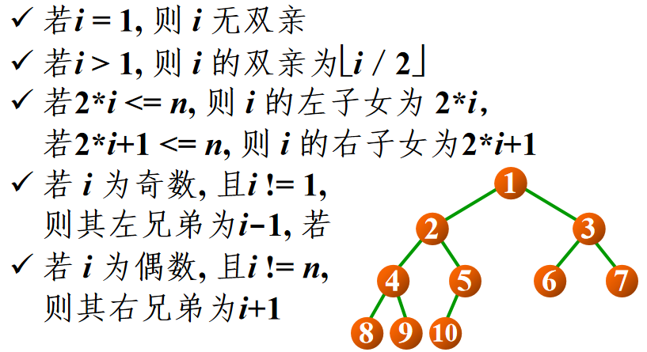
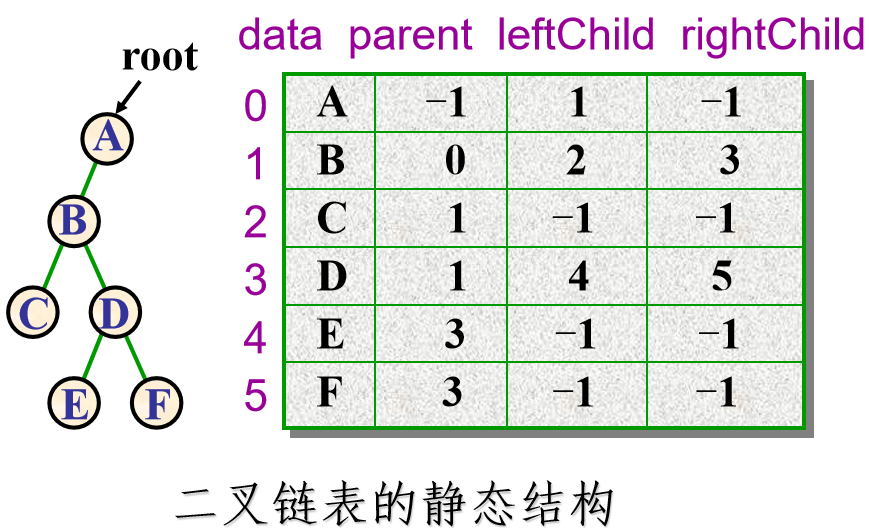

## 二叉树
### 基本术语
* 层次：规定根结点在**第一层**，其子女结点的层次等于根结点层次加一，依次类推。
* 深度：结点的深度和层次一样，根的深度为1，**最深结点**表示树的深度。
* 高度：规定**叶结点**高度为1，越往上高度越高，**根节点最高**，根的高度即为树的高度。
* 度：结点的**子女个数**即为该结点的度，即**出边数**，**最大**的结点度为树的度
* 森林：是树的集合

### 定义
* 从数学的角度出发，二叉树是**结点的**一个**有限集合**，该集合或者**为空**，或者是由一个**根**和**互不相交**的左右**子二叉树**构成。
> 可以看到严格的概念定义中，空树也是二叉树！因此很多递归的终止条件为 `if(root==nullptr)`是完全合理自洽的
>
> 因此二叉树有5种形态：空、只有根、根和左子树、根和右子树、根和左右子树

* 且树是**边最少的连通图**，有等式 `点数 == 边数 + 1`恒成立，因此若度为0的结点数为`n0`，度为2的结点树为`n2`，有`n0 == n2 + 1`恒成立。
> 设度为1的结点数为 `n1`，则有 `n0 + n1 + n2 = n1 + 2*n2 + 1`，即 `n0 = n2 + 1`

* 满二叉树：所有层的结点都是满的，即深度为i的满二叉树，结点总数为 `2^i-1`个。
* 完全二叉树：设二叉树深度为k，若第1层到第k-1层都是满的，只有第k层**从右到左缺**若干结点(可以不缺)，则称其为完全二叉树。
> 那么深度为k的完全二叉树，结点总数为n，则有: `2^(k-1)-1 < n <= 2^k-1`，变形得 `2^(k-1)< n+1 <=2^k`，取对数，有`ceil(log(n+1)) = k`
>
> 设二叉树有n个结点，从根到下从左到右从1开始给每个结点编号，则有关系如下：



### 二叉树的表示
* 顺序表示

> 适用场景比较特殊，表示**完全二叉树**是优越的；但没办法高效表示**一般**的二叉树，每一层一有空结点就会造成数组元素的浪费。

就是用数组，每个结点都有编号对应**数组下标**，即使为**空也占位**。

因此在表示**完全二叉树**时，没有数组元素的浪费，因为都是满的最后一层结点也是从左到右排列。

而极端情况下，只有**右单支**的二叉树则浪费最多，第i层浪费 `2^(i-1)-1`个数组元素。

* 链式表示

对于通用的二叉树，链式才是典中典，相应的在链式结构上的**递归算法**也是典中典。

最典型的，**二叉链表**表示，只有左右子树两个指针：
```cpp
template<class T>
struct node{
    T data;
    node *left;
    node *right;
};
```
当然课件上也给了**三叉链表**表示法，多了一个指向父结点的指针
> 加的`parent`指针域有点像Linux中的..目录，也可以区分，在一些场景下，比如查找父结点时还是很方便的
```cpp
template<class T>
struct node{
    T data;
    node *parent;
    node *left;
    node *right;
};
```

当然也祭出了**静态链表**表示法，hh有链表的地方就考虑用静态大小的数组结构表示一下，虽然我从来没用过就是说🤣直接看图吧， `data`就是固定大小为6的数组，存储所有6个树结点：



### 一些算法

典中典的求深度，求结点个数，求父结点就不用多说了，阉割版的广义表了属于是。说一下根据前序遍历序列创建二叉树吧。

* 二叉树的创建

比如 `ABC@@DE@G@@F@@@;`的序列，由于先序的特点，递归函数也是先序顺序创建的。说说函数原型：
```cpp
CreateBinTree(istream &in, BinTreeNode<T> *&r) {
    T chr;
    in >> chr;
    if(chr == ';')
        return;
    if(chr == '@') { //表示空
        r = nullptr;
        return;
    }
    //不为空则创建 根结点
    r = new BinTreeNode<T>;
    r->data = chr;
    CreateBinTree(in, r->left);
    CreateBinTree(in, r->right);
}
```
注意到参数 `r`是个**指针的引用**，回想之前创建广义表的时候放入的是指针，是因为那里的 `l`已经指向了存在的结点(为了**更自然地适配**构造函数已经确定的行为，即**初始化**时就让head指向了存在的结点)

而这里我们二叉树的构造函数中 `root`初始就是个`nullptr`，因此要改的话必须要改 `root; root->left; root->right`**本身**，在函数体内部创建新结点并修改`r`的值。
> 不知道为啥这勾吧课件老喜欢玩这种C语言游戏，莫名其妙的炫技
>
> 而且它创建广义表的函数实现根本跑不通，看了它的代码还干扰了👴自己实现

* 基于栈的二叉树非递归遍历

同样典中典的**递归法**前中后序遍历就不多说了，这里说一下基于栈的**非递归遍历**。呃其实就是如何把递归函数用栈**改写成非递归**。

说实话我是不太会这个的，手动模拟**函数调用堆栈模型**，直接抄的课件代码。直接看代码吧，实现在 `Tree/BinTree.h`的`xxxOrder_new()`系列函数。
> 话说改写成非递归感觉对性能啥的没啥本质上的提高，参数和调用现场该保存多少还是得保存多少，更重要的一点是，机器不会错，而你的模拟会错
>
> 权当复习函数模型了就是说🤭

* 二叉树的层次遍历

队列的应用了就是说，算法是非递归的，同样典中典。我只能说课件上的实现很丑，见 `levelOrder()`函数。

-----


## 线索二叉树

### 出现意图

用递归可以很方便实现前中后序遍历，生成一个**线性序列**。但是对于给定的一个结点，如何很方便得到其**前中后序遍历中**的**前驱结点**和**后续结点**？

显然这时候再去生成**整个**二叉树的遍历序列是不太划算的，并且如果二叉树中有结点值相等，单从序列的值来看是**难以区分**是哪个结点，**线索二叉树**就是为了解决这个问题。

对树做**预处理**，将某种遍历序列的**前驱后续关系**直接记录在树的**存储结构中**，以便于**高效找到**某结点的前驱和后续结点。
> 显然线索二叉树有三种，前序线索二叉树、中序线索二叉树和后续线索二叉树

### 实现线索树

* 实现方法的思考

一个最简单的想法，每个结点再增加两个指针域。即除了左右子树的指针，再加一个**前驱指针**和一个**后续指针**，这样一个结点就有4个指针域了。

但是，一个基本的事实是：原来的二叉链表实现中，n个结点的树，有**2n个指针域**，但是**只有n-1个指针**是被利用起来的(也就是树中的n-1条**边**)，剩下**n+1个指针都是空的**。

这个利用率已经非常低了，先别想着直接暴力增加新的指针域，能不能把这些以前没用上的指针域**利用起来**？

* 左右线索标志

我们的设计是，每个结点**增加两个比特**，即左右线索标志，利用标志信息来**充分利用**那些空的指针域，设计如下：
```cpp
template<class T>
struct node{
    T data;
    char ltag:1;
    char rtag:1;
    node *left;
    node *right;
};
```
当 `ltag/rtag == 0`时，左右指针和二叉链表一样表示子树；当 `ltag/rtag == 1`时，这时的左右指针就表示**前驱后继**了，也就是**线索**。
> 但是C语言这个**位域**分配结构体时，还得**考虑对齐**，**紧挨着写**在一起是最省的。设置成 `char`类型，这两个比特最小可以**只占一个字节**。
>
> 只浪费了6个比特，神中神就是说🤭

* 实现中序线索二叉树

课件上只重点给出了**中序线索树**的实现，这是因为，结点没有线索可用时，即`tag==0`左右指针表示子树时，某个结点中序遍历的的前驱和后继结点都比较容易寻找。

即：**前驱**结点为左子树中序遍历的**最后一个结点**；**后继**结点为右子树中序遍历的**第一个结点**。

对于二叉树的中序线索化也很巧妙，中序递归模板，同时利用了 `pre`指针引用神来之笔。具体实现见 `Tree/ThreadTree.h`文件中。
> 太麻烦了这东西，真不想看了😭而且感觉日常也用不到

* 中序线索树的应用

利用中序线索找出**任意给定结点的父结点**，之前二叉链表的实现中，我们**用递归**的方法，复杂度为 `O(n^2)`。用中序线索的话可以降到**线性级别**。

这里不得不提一下中序线索树的**优越性**，左中右的特点，实际上中序遍历下的**最后一个**结点就是不断`r = r->right`的**最右侧**结点。而中序遍历下**第一个结点**就是 `r = r->left`**最左侧**结点。
> 我们实现找中序遍历下的第一个结点`InFirst`和最后一个结点 `InLast`，实际上是**尾递归**，和**迭代**一回事！两种写法行为完全一致。

**基本思路**：任意结点只可能是**直接父**的左指针或者右指针**两种情况**。

因此对于任意给出的结点 `r`，**首先假设**它是其**直接父**结点的左指针，这样的话其父结点**就是**：`r`的右子树中序遍历的**最后一个结点**的**后驱**线索。
> 由于树已经被中序线索化了，除了首个结点的前驱和末尾结点的后续，已经**没有空指针**了，因此不能靠 `r->right==nullptr`来判断是否到达最右侧，而要看是否`rtag == 1`，碰到线索说明到头了
>
> 这也是在 `CreateInThread()`中序线索函数时，千万不能忘了让最后一个结点 `pre`也要标记好 `rtag==1`，即使其后驱线索为 `nullptr`。

如果这个后驱**为空**则说明找到整个树的末尾结点了，`r`**实际上**是直接父的**右指针**，那么根据左中右的特点，其父结点是其**左子树**中序下**第一个结点的前驱**。

而如果这个后驱**非空**还需要判断到底是不是**直接父**结点，因为有可能是**爷爷结点**的左子树下而在直接父的右子树下，这时的`p`**是爷爷不是直接父**。

总之只要 `p && p->left!=r`就说明**假设错误了**，`r`应该是**直接父**的右指针。（返回爷结点的情况很容易忽略就是说😄

> 当然可以先假设为父结点的右指针，这样若左子树首个结点前驱为空说明实际为左指针，一回事的。总之因为我们不知道到底是左子还是右子，只能**都尝试一遍**。

具体实现在 `Parent()`函数中，就是两个平行的`while`循环，复杂度为`O(n)`，并且如果试图找根结点的父结点，会返回`nullptr`，很和谐就是说😄

-----


## 树和森林


## 堆

## 霍夫曼树

