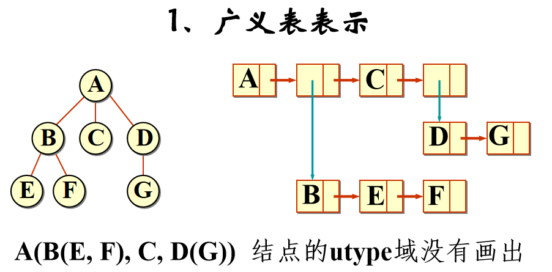

## 二叉树
### 基本术语
* 层次：规定根结点在**第一层**，其子女结点的层次等于根结点层次加一，依次类推。
* 深度：结点的深度和层次一样，根的深度为1，**最深结点**表示树的深度。
* 高度：规定**叶结点**高度为1，越往上高度越高，**根节点最高**，根的高度即为树的高度。
* 度：结点的**子女个数**即为该结点的度，即**出边数**，**最大**的结点度为树的度
* 森林：是树的集合
* 有序树：树中某结点的各个子树是有次序的，比如左子树和右子树不同，不能交换，则称其为有序树

### 定义
* 从数学的角度出发，二叉树是**结点的**一个**有限集合**，该集合或者**为空**，或者是由一个**根**和**互不相交**的左右**子二叉树**构成。
> 可以看到严格的概念定义中，空树也是二叉树！因此很多递归的终止条件为 `if(root==nullptr)`是完全合理自洽的
>
> 因此二叉树有5种形态：空、只有根、根和左子树、根和右子树、根和左右子树

* 且树是**边最少的连通图**，有等式 `点数 == 边数 + 1`恒成立，因此若度为0的结点数为`n0`，度为2的结点树为`n2`，有`n0 == n2 + 1`恒成立。
> 设度为1的结点数为 `n1`，则有 `n0 + n1 + n2 = n1 + 2*n2 + 1`，即 `n0 = n2 + 1`

* 满二叉树：所有层的结点都是满的，即深度为i的满二叉树，结点总数为 `2^i-1`个。
* 完全二叉树：设二叉树深度为k，若第1层到第k-1层都是满的，只有第k层**从右到左缺**若干结点(可以不缺)，则称其为完全二叉树。
> 那么深度为k的完全二叉树，结点总数为n，则有: `2^(k-1)-1 < n <= 2^k-1`，变形得 `2^(k-1)< n+1 <=2^k`，取对数，有`ceil(log(n+1)) = k`
>
> 设二叉树有n个结点，从根到下从左到右从1开始给每个结点编号，则有关系如下：


### 二叉树的表示
* 顺序表示

> 适用场景比较特殊，表示**完全二叉树**是优越的；但没办法高效表示**一般**的二叉树，每一层一有空结点就会造成数组元素的浪费。

就是用数组，每个结点都有编号对应**数组下标**，即使为**空也占位**。

因此在表示**完全二叉树**时，没有数组元素的浪费，因为都是满的最后一层结点也是从左到右排列。

而极端情况下，只有**右单支**的二叉树则浪费最多，第i层浪费 `2^(i-1)-1`个数组元素。

* 链式表示

对于通用的二叉树，链式才是典中典，相应的在链式结构上的**递归算法**也是典中典。

最典型的，**二叉链表**表示，只有左右子树两个指针：
```cpp
template<class T>
struct node{
    T data;
    node *left;
    node *right;
};
```
当然课件上也给了**三叉链表**表示法，多了一个指向父结点的指针
> 加的`parent`指针域有点像Linux中的..目录，也可以区分，在一些场景下，比如查找父结点时还是很方便的
```cpp
template<class T>
struct node{
    T data;
    node *parent;
    node *left;
    node *right;
};
```

当然也祭出了**静态链表**表示法，hh有链表的地方就考虑用静态大小的数组结构表示一下，虽然我从来没用过就是说🤣直接看图吧， `data`就是固定大小为6的数组，存储所有6个树结点：


### 一些算法

典中典的求深度，求结点个数，求父结点就不用多说了，阉割版的广义表了属于是。说一下根据前序遍历序列创建二叉树吧。

* 二叉树的创建

比如 `ABC@@DE@G@@F@@@;`的序列，由于先序的特点，递归函数也是先序顺序创建的。说说函数原型：
```cpp
CreateBinTree(istream &in, BinTreeNode<T> *&r) {
    T chr;
    in >> chr;
    if(chr == ';')
        return;
    if(chr == '@') { //表示空
        r = nullptr;
        return;
    }
    //不为空则创建 根结点
    r = new BinTreeNode<T>;
    r->data = chr;
    CreateBinTree(in, r->left);
    CreateBinTree(in, r->right);
}
```
注意到参数 `r`是个**指针的引用**，回想之前创建广义表的时候放入的是指针，是因为那里的 `l`已经指向了存在的结点(为了**更自然地适配**构造函数已经确定的行为，即**初始化**时就让head指向了存在的结点)

而这里我们二叉树的构造函数中 `root`初始就是个`nullptr`，因此要改的话必须要改 `root; root->left; root->right`**本身**，在函数体内部创建新结点并修改`r`的值。
> 不知道为啥这勾吧课件老喜欢玩这种C语言游戏，莫名其妙的炫技
>
> 而且它创建广义表的函数实现根本跑不通，看了它的代码还干扰了👴自己实现

* 基于栈的二叉树非递归遍历

同样典中典的**递归法**前中后序遍历就不多说了，这里说一下基于栈的**非递归遍历**。呃其实就是如何把递归函数用栈**改写成非递归**。

说实话我是不太会这个的，手动模拟**函数调用堆栈模型**，直接抄的课件代码。直接看代码吧，实现在 `Tree/BinTree.h`的`xxxOrder_new()`系列函数。
> 话说改写成非递归感觉对性能啥的没啥本质上的提高，参数和调用现场该保存多少还是得保存多少，更重要的一点是，机器不会错，而你的模拟会错
>
> 权当复习函数模型了就是说🤭

* 二叉树的层次遍历

队列的应用了就是说，算法是非递归的，同样典中典。我只能说课件上的实现很丑，见 `levelOrder()`函数。

-----


## 线索二叉树

### 出现意图

用递归可以很方便实现前中后序遍历，生成一个**线性序列**。但是对于给定的一个结点，如何很方便得到其**前中后序遍历中**的**前驱结点**和**后续结点**？

显然这时候再去生成**整个**二叉树的遍历序列是不太划算的，并且如果二叉树中有结点值相等，单从序列的值来看是**难以区分**是哪个结点，**线索二叉树**就是为了解决这个问题。

对树做**预处理**，将某种遍历序列的**前驱后续关系**直接记录在树的**存储结构中**，以便于**高效找到**某结点的前驱和后续结点。
> 显然线索二叉树有三种，前序线索二叉树、中序线索二叉树和后续线索二叉树

### 实现线索树

* 实现方法的思考

一个最简单的想法，每个结点再增加两个指针域。即除了左右子树的指针，再加一个**前驱指针**和一个**后续指针**，这样一个结点就有4个指针域了。

但是，一个基本的事实是：原来的二叉链表实现中，n个结点的树，有**2n个指针域**，但是**只有n-1个指针**是被利用起来的(也就是树中的n-1条**边**)，剩下**n+1个指针都是空的**。

这个利用率已经非常低了，先别想着直接暴力增加新的指针域，能不能把这些以前没用上的指针域**利用起来**？

* 左右线索标志

我们的设计是，每个结点**增加两个比特**，即左右线索标志，利用标志信息来**充分利用**那些空的指针域，设计如下：
```cpp
template<class T>
struct node{
    T data;
    char ltag:1;
    char rtag:1;
    node *left;
    node *right;
};
```
当 `ltag/rtag == 0`时，左右指针和二叉链表一样表示子树；当 `ltag/rtag == 1`时，这时的左右指针就表示**前驱后继**了，也就是**线索**。
> 但是C语言这个**位域**分配结构体时，还得**考虑对齐**，**紧挨着写**在一起是最省的。设置成 `char`类型，这两个比特最小可以**只占一个字节**。
>
> 只浪费了6个比特，神中神就是说🤭

* 实现中序线索二叉树

课件上只重点给出了**中序线索树**的实现，这是因为，结点没有线索可用时，即`tag==0`左右指针表示子树时，某个结点中序遍历的的前驱和后继结点都比较容易寻找。

即：**前驱**结点为左子树中序遍历的**最后一个结点**；**后继**结点为右子树中序遍历的**第一个结点**。

对于二叉树的中序线索化也很巧妙，中序递归模板，同时利用了 `pre`指针引用神来之笔。具体实现见 `Tree/ThreadTree.h`文件中。
> 太麻烦了这东西，真不想看了😭而且感觉日常也用不到

* 中序线索树的应用

利用中序线索找出**任意给定结点的父结点**，之前二叉链表的实现中，我们**用递归**的方法，复杂度为 `O(n^2)`。用中序线索的话可以降到**线性级别**。

这里不得不提一下中序线索树的**优越性**，左中右的特点，实际上中序遍历下的**最后一个**结点就是不断`r = r->right`的**最右侧**结点。而中序遍历下**第一个结点**就是 `r = r->left`**最左侧**结点。
> 我们实现找中序遍历下的第一个结点`InFirst`和最后一个结点 `InLast`，实际上是**尾递归**，和**迭代**一回事！两种写法行为完全一致。

**基本思路**：任意结点只可能是**直接父**的左指针或者右指针**两种情况**。

因此对于任意给出的结点 `r`，**首先假设**它是其**直接父**结点的左指针，这样的话其父结点**就是**：`r`的右子树中序遍历的**最后一个结点**的**后驱**线索。
> 由于树已经被中序线索化了，除了首个结点的前驱和末尾结点的后续，已经**没有空指针**了，因此不能靠 `r->right==nullptr`来判断是否到达最右侧，而要看是否`rtag == 1`，碰到线索说明到头了
>
> 这也是在 `CreateInThread()`中序线索函数时，千万不能忘了让最后一个结点 `pre`也要标记好 `rtag==1`，即使其后驱线索为 `nullptr`。

如果这个后驱**为空**则说明找到整个树的末尾结点了，`r`**实际上**是直接父的**右指针**，那么根据左中右的特点，其父结点是其**左子树**中序下**第一个结点的前驱**。

而如果这个后驱**非空**还需要判断到底是不是**直接父**结点，因为有可能是**爷爷结点**的左子树下而在直接父的右子树下，这时的`p`**是爷爷不是直接父**。

总之只要 `p && p->left!=r`就说明**假设错误了**，`r`应该是**直接父**的右指针。（返回爷结点的情况很容易忽略就是说😄

> 当然可以先假设为父结点的右指针，这样若左子树首个结点前驱为空说明实际为左指针，一回事的。总之因为我们不知道到底是左子还是右子，只能**都尝试一遍**。

具体实现在 `Parent()`函数中，就是两个平行的`while`循环，复杂度为`O(n)`，并且如果试图找根结点的父结点，会返回`nullptr`，很和谐就是说😄

-----


## 树和森林

上面讲的都是**二叉树**，每个结点最多有两个子树，那么如何表示广义的树形结构？

### 树的表示

#### 一些尝试
* 广义表表示法

显然广义表可以满足这个需求，最强大的链式结构，每个**子树对应一个子表**，并且由于树的定义，左右子树**没有交集**，因此也**不存在共享表**的问题。



> 广义表很强大，但是从图中可以看到，广义表的天然语义是一种**包含关系**，而树形结构是**父子关系**，表示起来还是**不够自然**。

* 双亲表示法

用数组来存储结点，其实就是个非常简单的**静态链表**，数组中的每个元素存的**结点值**和**父结点的下标**，而**存放顺序**一般不做特殊要求，按照层次序就可以。
> 比二叉树那节提到的静态二叉链表简单的多，那个静态链表每个元素要存结点值、左右子结点**下标**以及父结点**下标**。这个双亲表示法，就还真**只存了**父结点下标🤭xs

* 子女链表表示法

同样是用数组来存储结点，但是双亲表示法的话，由于每个结点**只有一个确定的父结点**，因此可以实现固定好数组元素大小。

而子女链表表示中，每个结点不再存父结点的下标，而是存**所有子女结点的数组下标**，因为子女个数是不确定的，因此用**链表结构**来存储。
> 同样数组中结点的存储顺序随意，如果是**有序树**，子女结点下标在链表中应该**从左到右**存储。

* 子女指针表示

上面两种数组结构看看笑话就好了，正常人应该都不会用这东西吧🤭子女指针类似于二叉链表那样每个结点存放子女结点指针，但问题在于，每个结点的**子女个数是不确定**的，因此只能让结点包含**该树的度**个指针。

**度**就是最大的结点出边树，显然这样会造成**很多指针域的浪费**。

#### 子女兄弟表示法

可以看到上面几种缺点都太明显，能不能像二叉链表那样，**两个指针**走天下？这就是**子女兄弟**表示法，每个结点的结构如下：

```cpp
template<class T>
struct node{
    T data;
    node<T>* son; //指向下一层
    node<T>* bro; //指向同一层的后续
};
```
子女指针表示法中，每个指针**都**表示的父子关系，因此难以处理子女数不确定的情况；而子女兄弟表示法中，一个指针表示**父子关系**、一个指针表示**兄弟关系**，多个子女可以靠兄弟指针连续在一起。

形成的结构如下：


这样一来**层次结构**非常清楚，并且完美表示了**任意树**，可以说综合了**子女链表**和**子女指针**两种表示法。

可以看到对于所有子女的访问都是靠**第一个孩子**，因此也叫**长子-兄弟表示法**


### 子女兄弟表示实现

具体实现在`Tree.h`文件中。

典中典的做法， `Tree`类中包含了一个`TreeNode *root`指针，表示**树的根**。初始化为`nullptr`表示树为空.

在子女兄弟树上的递归算法也是典中典，无非就是在二叉树中，只有左右**两个子女**，而广义树中有很**多个子女**罢了，**递归的思路是完全一样**的😄

`Tree`类还有一个成员变量`TreeNode *current`**当前结点指针**，这玩意说实话感觉没啥用处，课本上的解释说是为了在**子女链表**中有序**插入新的结点**时可以用`current`**指示位置**来提高插入效率。
> 然而课本课件彷佛完全忘了插入算法这一回事，写了接口没写实现😅那我也不写了嘻嘻🤭

### 表示森林

就是说我们太喜欢**二叉结构**了，长子-兄弟表示法就是二叉结构，而且可以很好表示**任意树**，注意到对于**单独一棵树**，长子-兄弟表示法下，根结点一定**没有兄弟只有子女**。

这太好力，表示森林的话就可以让这些**树的根互相成为兄弟**了，同样还是长子-兄弟的**二叉结构**，比如：


显然，**森林和二叉树有一一对应的关系**。

#### 森林的遍历

* 森林的先根遍历

**等同于二叉树的先序遍历**

可以使用之前单棵树的遍历算法，**一棵树一棵树**进行，每棵树上**外部调用**递归算法，不难看出是**中左右**的顺序

* 森林的后根遍历

**等同于二叉树的中序遍历**

同样也要一棵树一棵树进行，每棵树上**外部调用**递归算法，不难看出是**左中右**的顺序

* 森林的层次遍历

区别只在于，初始化队列时，需要把根的**所有兄弟**都入队，也就是森林每棵树的根，因为在**同一层**嘛🤭，而原来第一层只有一个根，后续的队列操作和之前完全一致。

-----

## 堆
### 概念的提出
数据结构**有序**是个神中神的性质，但想要达到有序常常要付出很多代价。一些场景下我们**不需要数据全部有序**，或者说需要在**使用之前**就全部有序。

比如说：**优先队列**，我们之前在 `Queue/PQueue.h`中的实现是，插入一个元素后立刻调用**排序算法**`adjust()`调整队列有序，这是很奢侈的，每次的代价最少都要`O(nlogn)`。

堆就是来解决这种问题的，我们**不需要全部有序**，只关注这组数据的**最大值/最小值**，也就是**堆顶**，并且其优越性体现在每次插入**调整堆的复杂度只用**`O(logn)`。

完美高效地实现了**优先队列**，当然堆的应用可不止这么简单。

### 定义
堆是存储在下标**从0开始**计数的**一维数组**中的。我们平时看到的树形结构是**逻辑上的**，因为堆本身就是**完全二叉树**，最后一层**从左到右**排列，可以完美用数组表示。
> 感觉完全二叉树的概念完全就是为了堆而提出的😄，数组结构可以使**随机存取**更加方便，而**完全二叉树**可以**完美用数组表示**，于是干脆堆直接就定义成了完全二叉树的样子。

下标从0从1开始无所谓的，课件是按照从0开始的这样更方便一点，只要记住是一层一层**从左到右**数组编号的就🆗了。

正如之前所说，堆没有维护所有数据的序，而维护的是**堆序heap-ordered**的关系，分为最大堆序和最小堆序。

如果堆中**有n个**结点，则数组下标从0到`n-1`，其中对于下标为i的结点：

* 下标关系
  * 如果 `i == 0`则为根结点，没有父结点；否则结点i的父结点下标为 `ceil((i-1)/2)`
  * 左子结点下标为 `2i+1`，右子结点下标为 `2i+2`，如果**超过**了`n-1`的话，说明**没有子结点**

* 最大堆/大顶堆

维护**大顶堆序**，每个结点的值都**大于等于**其左右**子结点的值**，也就是 `Ki >= K(2i+1) && Ki >= K(2i+2)`

* 最小堆/小顶堆

维护**小顶堆序**，每个结点的值都**小于等于**其左右**子结点的值**，也就是 `Ki <= K(2i+1) && Ki <= K(2i+2)`

### 堆的实现
实现在`Tree/Heap.h`文件中，我们重点实现了小顶堆，大顶堆思路是一样的。

有两种方法构建堆，一种是首先创建一个**空堆**，然后一个个插入元素，插入后进行**调整**。

第二种方法就是直接用一个**数组初始化堆**，然后需要不断**调整这个数组变成堆**，对应**构造函数**`MinHeap(T *a, int n);`。

* 那么如何调整？

**从下到上**调整，最后一个结点的父结点即`data[(n-1-1)/2]`，向下滑动 `siftDown`，即：将本结点和**左右子结点的较的那个**交换，如果结点比左右子结点都小，则**调整成功了**。

* 为什么非得从下到上？

调整的算法实际上也是**动归**的思想，如果我们保证**左右子树**都已经**成功调整成了堆**，那么说明左右子树的根**都是最小值**，这时交换其中的最小值**到根**，那么根可以保证是整棵树的最小值，**根结点调整完成**。

因此我们手动使用从**最后一个结点的父结点**`data[(n-1-1)/2]`开始调整，也就是从最小的问题开始解决，之后**高层的结点**调整时可以保证拿到的左右结点为**所在子树的最小值**。
> 妥妥的动归，先解决小问题，然后大问题利用小问题的成果来解决。

* 下滑调整？

注意，子问题的结果为：调整结点i，最终结点i变为其**所在子树的最小结点**。显然，从小到上的顺序是**自然而然的**。

但我们看到的下滑调整可不只是交换自己和左右子结点的较小值那么简单，它是**一路下滑**调整所有不合适的结点。

下滑**不会破坏**左右子树的堆结构的，因为下滑时，交换的是左右子结点的**较小值**，因此下滑后可以保证**仍然是小顶堆**结构。

基本流程如下：
* 找到结点左右子结点的较小值m
* 比较本结点和m的大小，如果本结点更大则需要交换这两个结点，并更新下标
* 如果本结点比m小说明调整完成，因为**动归**的思想，本结点之下是个**子堆**，的堆序是完好的，没有受到破坏

实现如下：
```cpp
void siftDown(int start, int m){
    int i = start, j = 2*i + 1;
    T the_data = data[i];
    while(i <= m){
        if(j < m && data[j+1] > data[j]) //j指向左右子结点的较小值
            j += 1;
        if(the_data > data[j]){ //本结点比较小的子结点大 则下滑
            data[i] = data[j];
            data[j] = the_data;
            i = j;
            j = 2*i + 1;
        }
        else //当本结点比左右子结点都大 调整结束 
            break; 
    }
}
```
显然，从初始本结点下标 `start`开始调整到允许的最大下标为 `m`，每次下滑下标调整为 `i = j;` 而 `j = 2*i+1`是二倍**二倍增加的**，复杂度一定为 `O(logn)`，n为堆中**结点总数**。

因此，将一个无序数组从下到上调整成堆的复杂度为 `O(nlogn)`。但这是一个很松的上界，因为只有根节点的下滑代价为logn，而构建堆的代价和完全二叉树**所有结点的高度和**一致，可以算出来代价实际为`O(n)`.


### 向堆插入新元素

我们的插入操作是简单的把新结点**加到数组末尾**，然后**上滑调整**。

同样，因为插入前数组**已经是**完美的**堆结构**了，我们需要实现像下滑调整那样，**不破坏堆序**进行调整。流程为：

* 比较自己和父结点`data[(i-1)/2]`的大小，如果大说明调整完成
* 如果小的话则**交换**自己和父结点，由于调整之前就满足堆序，父结点一定比左右子都小，现在**换了一个更小**的，当然满足堆序。
> 父结点被换下之后当然不用再下滑了，因为调整之前就已经保证父结点比所有子女都小，换下去照样小🤭

实现如下：
```cpp
void siftUp(int start){ //从start向前到0
    int i = start, j = (i - 1)/2; //j指向父结点
    T the_data = data[i];
    while(i > 0){ //i==0为根结点 直接跳出
        if(the_data < data[j]) { //父结点下滑
            data[i] = data[j];
            data[j] = the_data;
            i = j;
            j = (i - 1)/2;
        }
        else
            break;
    }
}
```
下标改变为 `i=j` 而 `j = (i-1)/2`，每次变为原来的**一半**，复杂度为`O(logn)`.


### 删除堆的元素

一般的删除操作是**去除堆顶**，也就是**整棵树的最小值**。同样我们知道，**左右子树/堆**都是完美的堆结构，因此只需要取**数组末尾的元素**放入数组头，然后下滑调整即可，我们的实现知道下滑不会破化堆结构。

取数组末尾同样是出于**不破化堆结构**的考虑，最后一个结点删了，显然对堆序没有任何影响。放到堆顶然后 `siftDown(0, size-1)`一次过。同样复杂度为`O(logn)`.

-----

## 霍夫曼树

### 基本概念

霍夫曼树又称**最优二叉树**，即**加权路径长度最短**的二叉树，因此首先我们得知道二叉树中**路径**的概念：

* 路径(path)：从树中一个结点到另一个结点的**分支**构成两结点之间的路径
> 由树的定义可知，树中任意两个结点之间**有且只有一条路径**。有是因为树是连通图。
> 
> 可以证明最多只有一条，可以分类：如果两个结点构成父子关系，那么路径只有一条是显然的；
> 
> 而如果不在同一个子树(树的定义中两个子树为不相交的点集)，那么这条路径必定通过**二者的公共祖先**，祖先也就是**二者的根**，**从A到根**路径唯一，**从根到B**路径唯一，因此**从A到B**路径唯一。


* 路径长度(path length)：路径上的**分支条数**。
* 外结点/外部路径：树的**叶结点**称为外结点，所有外结点的路径之和为**外部路径**EPL
* 内结点/内部路径：树的非叶结点，即**分支结点**称为内结点，所有内结点的路径之和为**内部路径**IPL
* **树的路径长度**：根结点到**其余所有结点**的路径长度**之和**，即**外部路径+内部路径**

我们假设根结点层数**为1**，则第k层结点到根结点的**路径长度**为 `k-1`，第k层**共有** `2^(k-1)`个结点。如果按照满二叉树来看的话，摆下来是这样的：

```c
(第2层)1,1,(第3层)2,2,2,2,(第4层)3,3,3,3,3,3,3,3,(第5层)4,4,4,4,4,4,4,4,4,4....
```

显然，对于有**n个结点**的树，**完全二叉树的路径长度最小**，为 `PL = sum(ceil(log(i+1)))`，其中i从0到n-1表示n个结点的下标。
> 不难证明，因为完全二叉树是从左到右紧挨着取，而非完全二叉树**跳着取**后面的值，只会更大

**要注意**，**不是只有**完全二叉树路径长度最小，事实上可以看到，只要除了最后一层剩下的**每一层都全满**，路径长度就是最小的。

因此，更确切地说，**平衡二叉树的路径长度最小**，完全二叉树是一种特殊的平衡二叉树，世界线收束了属于是😋

### 带权路径

对于一组权值 `{w1, w2, w3...}`，给二叉树的每个**叶结点**一个**权值**，则该二叉树称为**这组权值的扩充二叉树**。

这时，**带有权值的叶结点**成为扩充二叉树的**外结点**；**不带权值的分支结点**称为扩充二叉树的**内结点**。

* 带权路径长度：外结点到根结点的路径长度**乘以**权值
* **树的带权路径长度**(WPL)：树中**所有外结点**的带权路径长度**之和**
* **最优二叉树**：给出一组权值 `{w1, w2, w3...}`，WPL最小的扩充二叉树就是**这组权值的最优二叉树**。也就是霍夫曼树！
> 从结点路径长度到树的路径长度PL，再到结点带权路径和树的带权路径长度WPL，终于给出了霍夫曼树的概念：给定权值上**WPL最小的扩充二叉树**。

显然，由于**外结点权值的不同**，霍夫曼树不一定是完全二叉树，而应该是：**外结点权值越大，离根结点越近**。
> 完全二叉树相当于所有外结点的权值都相等


### 构建霍夫曼树

也就是：构建二叉树，使得**权值越大**的叶结点离根结点**越近**。

基本的**贪心法**思路：既然要权值大的靠近根，那么我们**从下到上**构建，每次找**根结点权值最小**的扩充二叉树**合成**一个新的树，直到最后**只剩下一棵**树，构建就完成了。
> 给定的n个权值首先构造n个**带权值的根结点**，然后合并**n-1次**，每次合并后**新的根权值**=左右子树根结点的**权值之和**

合并n-1次后，最后一定只剩下一个根，就是最终的结果。

* 代码实现

我们使用之前实现的**最小堆**来高效寻找权值最小的两个根，堆里放入当前所有**根的指针**，这样子最高效且正确。

但是这就有个致命的问题，我们没办法重载 `HuffmanNode *`即结点**指针的比较函数**，这是C++的规定。
> Overloaded 'operator<' must have at least one parameter of class or enumeration type.

而我们不像课本那样直接存结点，是因为在**我们实现的**堆中，插入堆会有一个 `data[curSize] = x`的赋值操作，也就是说结点放入堆是**重新拷贝**了一份，**地址已经被改变了！**。

> 所以这勾吧课本又错了😅我怀疑他写完代码根本就不跑

也就是说，堆里存结点**根本不可行**，存指针才对。但问题是堆中的两个 `HuffmanNode*`指针没办法直接重载比较，于是我**套了个皮**：
```cpp
class PointerWrapper{ //HuffmanNode指针的套皮
public:
    HuffmanNode *p;
    PointerWrapper(): p(nullptr) { ; }
    explicit PointerWrapper(HuffmanNode *a) : p(a) { ; }

    bool operator<(const PointerWrapper&r) const{
        return p->data < r.p->data;
    }
    //...
};
```
既然没法直接比指针，那我套个皮，重载套皮对象的比较操作符，名正言顺就是说🤭

### 应用

霍夫曼编码。

要给每个字母编码，要求又能根据编码翻译文章，又不想定长编码那么简单，想**变长编码**尽量省码长
> 也就是不同的字母的编码长度是不一样的

就算不懂霍夫曼树我们也知道，出现**频率越高**的字母编码应该**越短**，这样文章的总编码长度更短。

使用霍夫曼树，按照每个字母的**出现频率**作为**初始根结点的权值**，然后构建霍夫曼树即可。

霍夫曼树可以保证，字母的编码为**前缀编码**，即每个编码都**不可能**是其他编码的前缀，可以**避免二义性**。
> 这不显然么，因为字母都是叶结点，已经到头了，还怎么变成其他结点的前缀？😅


