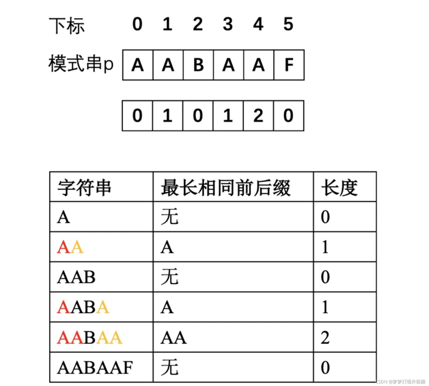

# 数据结构

## 线性表
线性表是一种抽象数据类型，即每个结点只有**唯一的**前驱结点和后继结点。内部的实现可以用顺序存储(基于数组)或者链式存储(基于链表)

我们将线性表封装成一个**抽象基类**，在文件`LinearList.h`中，定义了一堆纯虚函数，即线性表需要提供的接口，之后用顺序存储和链式存储的方式分别实现。

下面的实现中，我们默认的下标位置**从0开始**.

### 顺序存储
定义在`LinearList/SeqList.h`文件中，是抽象基类的一个实现。

抽象基类的构造函数和析构函数完全可以不写，写的话需要加上`=default`的关键字。

* `last == -1;`表示线性表为空

* `size == last + 1;`这是invariant，即该类在任何情况下都要满足的**定式**

### 链式存储
定义在`LinearList/LinkList.h`文件中，也是抽象基类的实现，不过由于抽象基类把诸如Search和Locate这样的函数，返回值都固定成int，这是否有点管的太宽。

索性不虚函数了，就是说这书上真是错误百出，顾头不顾尾😅


一个简单的测试函数：
```cpp
int main() {
    List<int> myseq;
    myseq.Input();
    cout << myseq.Locate(3)->data << endl;
    myseq.Output();
    return 0;
}
```
### 循环链表
定义在`LinearList/CircList.h`文件中，同样设置了结点**结构体**和链表类，操作大同小异，只不过对于last结点的处理可能会复杂一点，因为不再指向NULL而是指向first，

因此关键就在于末尾结点处的增删，要保证**成环**就OK。

这个循环链表我们也添加了**附加头节点**。

### 双向循环链表
双向循环链表**同样添加**附加头节点，定义在`LinearList/DblList.h`中，双向链表就好用多了，只要找到需要的那个cur结点，左右就全知道了，根本不用再像单向那样需要凑cur之前的那个结点。

缺陷就是两个左右指针操作起来比较麻烦点。


## 栈
线性表，不管是顺序存储还是链式存储，我们说的是ADT的线性表，是栈和队列的基础。

栈和队列，是**限制存取位置**的表结构。

很容易理解，比如STL的vector明明就能实现栈的功能，但是还有stack这种wrapper套皮vector的栈，就是因为ADT stack的Function是不提供按照下标访问功能的。

### 顺序栈
我们实现的最基础的基于数组的**顺序栈**模板类定义在`Stack/Stack.h`文件中。

我们约定：
  * `top == -1`时栈为空
  * `top`表示栈顶元素的下标

### 双栈共享栈空间
这是个比较秀的结构，说是为了更好地利用内存空间，减少内存的浪费。定义在`Stack/DualStack.h`文件中。

让两个栈共享一个数组，一个从0到maxSize生长，另一个从maxSize到0生长，有点像内存模型的栈和堆**双向奔赴**就是说😄

使用时需要指定用哪个栈，于是约定：
* 栈顶碰到一起则栈满了
* `top == 0`或者`top == maxSzie`为空，取决于用哪个栈，是从高到底生长还是从低到高生长。

不会真有人用这种东西吧，有点古早就是说，也可能是现在的封装库已经足够强大了。

### 链式栈

上面那种双栈共享空间来节省空间实在有点辣眼睛，还是链式存储吧。定义在`Stack/LinkedStack.h`文件中。

* 没有附加头节点，也就是说`top == nullptr`栈为空

* `push`和`pop`都直接用最简单的头插法，并且显然，链式栈不可能满。

### 栈的应用
典中典的计算中缀表达式，我们不必把中缀表达式转换成后缀，然后再解析后缀表达式那么麻烦，而是直接用双栈法。

* 设置一个val栈，一个opt栈，每读到一个数字就压如val栈，读到opt的话：
  * 设置opt的优先级，( 最低=0，+-=1， */=2，)最高=3
  * 如果当前的opt的优先级比opt.top()的优先级**高或等于**，那么就pop出opt的top并且val的两个值计算后再次push入val栈中
    * 直到当前的opt的优先级**大于**opt的top，或者栈为空或者遇到(才停止pop，将当前操作符压入opt中
    * 如果当前opt为)那么遇到(的话，也需要将(弹出，也就是说一对括号已经完成它的使命了🤭
    * 这样保证了高优先级的运算符先执行，同等优先级的运算符按从左到右的顺序执行
* 首先在opt栈push进(并在exp后加上`)`作为**哨兵**，保证最后压入)后可以保证将栈opt清理干净

简单计算器的实现在文件`SimpleCalculator.cpp`中，利用的是上面实现的链式栈，只能实现**一位整数**的加减乘除。

没有转换成后缀再去解析，是因为生成后缀表达式的过程和上面几乎完全一致，没有必要多此一举，如果确实需要后缀表达式的话：
* 不需要val栈，因为遇到数字直接输出，只需要opt栈，对于opt的操作和上面完全一致
* 当然可以设置()哨兵，即在opt栈先压一个(，在字符串最后拼一个)
> 因为后缀表达式不会出现括号。设置哨兵可以保证最后的)可以清空opt栈，更方便。

解析后缀表达式时，不用opt栈只用val栈，碰见数字直接压入val栈，碰见符号则弹出两个数字**计算后再压入**val栈，最后val栈的栈顶就是计算结果。

😄就是说生成后缀表达式只用opt栈，解析后缀表达式只用val栈，索性**直接双栈**痛快点。

## 队列
FIFO的结构，这里实现一个顺序存储一个链式存储。

### 顺序存储--循环队列
既然按照顺序存储，如果不提供自动扩展的话，队列能存放的最大元素个数是固定的。

一个循环队列的实现定义在文件`Queue/SeqQueue.h`中：
* `tail == head`时队列为空
* `tail + 1 == head`时队列为满
* `tail`实际上一直指向下一个可以写的空结点，但是为了方便判断队列满，实际上队列最后一个结点是无法使用到的。

### 链式队列
一个链式队列的实现在`Queue/LinkedQueue.h`文件中。

如果链式的话，那就不存在队列满的问题了，由于队列的操作是在头部和尾部进行的，因此需要`tail`和`head`指针。
* 当 `head == nukllptr`时队列为空

### 优先级队列
优先级队列的实现在 `Queue/PQueue.h`文件中。

同样是先进先出的结构，但是这个队列在 `push`的时候要自动按照优先级调整队列中元素的顺序，使得每次 `pop`的时候都是优先级**最高**的元素。

一般数字**越小**，优先级**越高**。

主要就是在普通队列插入后增加了一个 `adjust()`函数调整，将最新插入的元素找到一个合适的位置，一个个比较，复杂度为O(n)，就相当于插入排序了。


### 队列的应用

* 逐行打印二项展开式的系数

实现在`Queue/Pascal.cpp`文件中，首先向队列中压入初始的`011`，之后`pop`一个`getTop`一个，如果`first==0`则压入0和`first+second`，否则只压入`first+second`。

遇到`first == 0`就输出一个换行🤭

实现在 `Queue/Pascal.cpp`文件中。

## 数组、串和广义表
* 一维数组、二维数组多维数组那些东西，C语言的典中典了这里就不多说了，指针和内存模型之类的。。

* 还有对称矩阵的压缩：上三角和下三角矩阵存放到**数组**里，这样可以省一半的空间，然后根据二维元素的下标**计算出**数组中的下标来进行读写操作。
  三对角矩阵的压缩也同样，放到数组里然后计算**下标的映射关系**。

### 稀疏矩阵
这里主要实现一个稀疏矩阵吧，如果矩阵中**非零元素**占比 < 0.05，那这个矩阵就太稀疏了，很多空间都是浪费的，我们考虑用**三元组**表示那些非零结点：
```cpp
template<class T>
struct Triple{
    int row,col; //非0元素的行和列值
    T value;  //元素值
};
```
这里存的 `m_data`即`Triple<T>`结构体数组，信息少的可怜，我们的做法是让行数较小的元素三元组放到`m_data`数组中靠前的位置，即按照原始矩阵的**从上到下从左到右的顺序**存到`m_data`中。

于是有一个原始版的矩阵转置函数，就是扫描`m_col`**遍**所有元素，即`m_col`行，每次扫描找转置后**该行**的元素放到新数组中。
> 纯纯的暴力，复杂度是O(n*t), t是非零元素个数

于是就有：

* 快速转置算法

首先扫描一遍元素，对于转置后的每一行的元素信息存起来，即：每一行元素的个数和起始位置。然后再扫描一遍按照对应行的起始位置填写就行了。关键代码如下：
```cpp
for (int i = 0; i < m_term; i++) { //统计每一行的元素个数
    row_size[m_data[i].col]++;
}

row_start[0] = 0; //设置每一行的起始位置
for (int i = 1; i < m_col; i++) {
    row_start[i] = row_start[i - 1] + row_size[i - 1]; //第i行的起始位置
}

//开始填写
for (int i = 0; i < m_term; i++) {
    int the_row = m_data[i].col; //该元素应该在第the_row行
    int start = row_start[the_row]; //该元素应该放在的位置
    b.m_data[start].row = the_row;
    b.m_data[start].col = m_data[i].row;
    b.m_data[start].data = m_data[i].data;
    row_start[the_row]++; //修改这一行的起始位置
}
```
设置起始位置时，首先第0行的起始位置一定是0，然后第i行的起始位置=第i-1行的起始位置 + 第i-1行的元素个数。


这个方法还是比较好的，完完全全的下标操作，只存下标信息，**空间复杂度**尽可能降到了很小。
> 如果是我的话我可能直接二维vector了🤣当然不可能用堆区动态数组这种方法存结点，但是毕竟讲数据结构还是暂时远离STL吧
> 
> 就是说这个存下标的做法是正确的，一针见血的🤭重点抓的很好

上面的代码在`Table/SparseMatrix.h`文件中。

* 更多的表示方法

起始上面也看到了，用一个三元结构体的动态数组表示稀疏矩阵，处理起来很麻烦，虽然存储结构比较简单，但操作起来就很复杂。

课件上给了两种，一个将行拿出来，即列和数据二元结构体，然后把每一行的指针放到一个数组里，有点像二维动态那样子，但是课件上**仍然用数组**存二元结构体。
> 我不知道为什么不用二维动态数组，这个课件最后总是想用固定大小的数组来存结点，可能是考虑**非零元素个数固定**？不过这里确实二维动态的话有点小题大做，好吧我承认它重点抓的比较好，不做无用功是吧🤭
> 
> 😄就是说STL真伟大。


* 当然也祭出了十字链表这种东西

什么动态二维往后稍稍，知道什么叫动态么。直接给你正交，每个结点有个`down`和 `right`两个指针，每一行每一列还能成循环。

就是说这个东西还得用在矩阵加减运算的时候，因为上面我是没有实现矩阵加减操作的，因为涉及到生成新结点，不得不对数组大小进行调整，非常麻烦。。。

但是正交链表的话是很方便插入的，太麻烦了不想写www😭


### 字符串
* 区分一下子串和子序列

子串**要求连续**，子序列不要求，只需要保证字符的前后顺序。

字符串的一个实现在 `Table/AString.h`文件中，实现了对于一些基本操作符的重载，比如拼接，比较和提取子串等等。
> 其实这些东西都不重要，因为实现的再好也没有string强大就是说🤣

主要就是下面的字符串的**模式匹配**是重点！

#### KMP算法

* 大概流程

在一个字符串中寻找给定的子串，找到的话就给出下标，找不到返回-1。如果原始串长度为m，目标串长度为n，那么暴力嵌套搜索，复杂度为O((m-n)*n)，一般n<m，则复杂度为O(mn)。

这是因为，如果尝试匹配时，考虑**最恶心**的一种情况，一直匹配发现**最后一个字母不匹配**，那么前功尽弃，如果模式串很长的话，我们嵌套遍历的做法还得回退到原始串的下一个位置去重新匹配。

但是事实上，我们匹配到最后一个字母失配时，原始串中从**第一个**字母到**倒数第二**个字母的所有内容我们已经知道了，和模式串是完全匹配的。能不能**利用起来**？已经了解的东西何必再次当作什么都不懂的样子从头开始遍历呢？

假设第i个字母失配，那么原始串中对应部分和目标串的**0到i-1部分完全一致**，我们可以只**根据模式串的样式**，来确定某个字母失配时下一步应该由模式串的哪个字符与原始串的失配字符比较，这样**保证对于原始串的遍历没有回退**。

这通过 `next`向量来刻画，`next[i]`表示当**模式串**的第i个字符于原始串的相应字符**失配后**，**下一步**应该和原始串该字符比较的**模式串的字符下标**，显然`next[i] < i`。

* 算法实现

显然关键在于 `next`向量的生成，一种方法是直接抄的课件。。见`Table/AString.h`文件中的`getNext()`函数。
> 我觉得这个方法颠三倒四是可以说的嘛，它的next[0]规定是-1，毫无模式感，因为课件上的做法是第i个字符失配的话，直接用next[i]作为下次比较的下标，
> 因此需要在生成next[i]时绕点弯子，总之感觉奇奇怪怪，我也说不上来

我的实现在 `myGetNext()`和 `MyKMP_find()`函数中。

其实本质上是找某个字符串**最长公共前后缀**，注意！前缀不包含最后一个字符，而后缀不包含第一个字符，因此`aaaa`的最长公共前后缀为`aaa`.

那这显然就是个**动归**了（实际上课件也在动归，那么就用**动归**得到最长前后缀：对应题目为[寻找字串](https://leetcode-cn.com/problems/implement-strstr/)
```cpp
 //KMP算法就是说 关键在于用动归思想求出next数组
void getNext(vector<int>& next) { //利用dp思想找出模式串的特征
    int size = needle.size();
    next.resize(size);
    next[0] = 0;
    int k = 0;
    for(int i = 1; i < size; i++){
        //一直找符合的前缀的末尾下标k 使得p[k]=p[i] 
        //由于是从后向前回溯的 因此跳出循环时一定是最大的k 即最大的公共前后缀
        while(k > 0 && needle[i] != needle[k])
            k = next[k-1];  //这里本质上已经是KMP匹配了 是ch[k]尝试配ch[i]失配的情况
        //要牢记 ch[0:k-1]和ch[*:i-1]是匹配的 下一步找更短的前缀next[k-1]
        if(needle[i] == needle[k]) // 如果匹配上的话则k++获得匹配的长度
            k++;
        next[i] = k;
    }
}
```
注意到在 `needle[i] != needle[k]`失配时，其实已经是KMP算法了，`needle[k]`尝试匹配 `needle[i]`失配，则下一步尝试的k应该为`next[k-1]`。这和下面的KMP过程思路完全一致，因为说到底**都在使用公共前后缀**：

利用 `next` 数组的KMP算法：
```cpp
int strStr(string haystack, string needle) {
    this->haystack = haystack;
    this->needle = needle;
    int h_size = haystack.size(), n_size = needle.size();
    vector<int> next;
    getNext(next);
    int h_p = 0, n_p = 0;
    while(h_p < h_size && n_p < n_size){
        if(haystack[h_p] == needle[n_p]){
            h_p++;
            n_p++;
        }
        else{ //模式串当前字符不匹配 利用next得到下一个比较的下标
            if(n_p == 0){ //第0个字符串不匹配
                h_p++;
                continue;
            }else //n_p>0 说明0到n_p-1所有字符都匹配 下一个尝试的下标为next[n_p-1]
                n_p = next[n_p - 1];
        }
    }
    if(n_p < n_size) //匹配失败
        return -1;
    return h_p - n_size;
}
```



> 就是说next数组的生成次次看次次忘，哭死，总之就是最长公共前后缀，动归

### 广义表
虽然实际写代码的时候很少碰见广义表，但是这玩意的递归思想可谓典中典。

* 广义表的长度和深度

比如广义表： `C( ‘a’, ( 5, 3, ‘x’ ) )` 

广义表C的长度为2，深度为2，这个深度就已经是递归的概念了。长度为0时，广义表为**空**，即 `A=()`这样子。

* 表头表尾

表头和表尾的根本区别在于：表头是一个**结点**，而表尾是一个**子广义表**，这点在代码的实现中很容易看出。

广义表的**第一个**元素是表头，**除了表头外**剩下部分**加个括号**就是表尾，比如：

`C(‘a’, ( 5, 3, ‘x’ ))` C的表头`head(C) =‘a’`， C的表尾`tail(C) = ((5, 3, 'x'))`.

如果只有一个元素，比如 `A(6)` A的表头 `head(A) = 6` 而A的表尾为空，同样**去除首个元素加个括号**，即 `tail(A) = ()`。

* 广义表的head和tail操作

综合上面对表头表尾的解释，比如设广义表 `A = (apple,((orange, banana),(peach, pear, kiwifruit)))`，那么取出 `orange`的操作为：

`head(head(head(tail(A))))`

* 广义表的表示

显然只能用链式的结构，表的通用结点如下：
```cpp
... node{
    int type; //结点类型 =0表头; =1原子数据; =2递归的子表
    ... info; //信息 type=0时存放该表的引用计数(被引用的次数) type=1时存放原子数据本身 type=2存放指向子表表头的指针
    node *next; //下一格结点
};
```
上面展示的基本的结点结构，在实现时，出于资源的考虑，`info`字段可以用 `union`表示，这样不仅省空间而且更易读：
```cpp
template<class T>
struct node{
    int type; //0表头 1原子数据 2递归子表
    union{
        int ref; //0 引用计数
        T data; //1 原子数据本身
        GenList<T> *next; //2 递归的子表
    }info;
    node<T> *next; //下一个结点的指针
};
```

#### 广义表的实现

如果只是结点可能表示一个子表，那广义表其实就是树形结构了。但实际上广义表麻烦在，一个子表可以**被多个指针指向**，这就带来了**引用计数**的问题。

但**好在**，只有**子表**可以被指向，而不是普通的数据结点。在我们的实现中，就是只有每个表的**附加头**可以被多次指向，这样的话结构还清晰了不少，附加头立大功了属于是🤭

因此 `head`就表示附加表头，`type`一定为0，当`head->next == nullptr`时**广义表为空**。

* 基本动作

基本动作就两个， `Head`和 `Tail`，由于我们的实现`GenListNode<T>* head`指向的是**附加头结点**，因此实际的表是从 `head->next`开始的。

在 `Tail`中，我们的实现是**深拷贝**了一份尾子表，调用了 `Copy`私有方法，在下面的递归算法中将详细展开。

* 广义表的递归算法

广义表的部分操作，比如复制、求深度、比较都必须用递归来实现。可以看到我们每种递归好像都实现了**两套**，一份 `public`接口，一份 `private`接口。

我们最终使用这个广义表类时，肯定用的是 `public`接口，这个问题就在于， 而`public`成员函数的原型很**可能不太适用于递归**，因此这时候就需要**套个皮**🤭
> 就是个wrapper，内部的递归实现都在private函数中，并由public接口调用，最终的public函数类型都是很友好的、便于使用的。
> 
> 也就是课件上所说的，在实际的private函数中实现递归，肯定是**内部调用**(因为所有递归动作都在这里)；而最终呈现的public接口中包含对递归的**外部调用**，前面说了，就是个套皮罢了。
> 
> 课件还说，通常，把内部调用设置为私有函数，把外部调用设置为公有函数，这样结构更清晰漂亮一些hhhh

广义表的复制、释放、比较以及获取长度和深度都是递归，具体实现在文件 `Table/GenList.h`中，都有相应的注释。

* 广义表的创建

课件上给出一种创建方式是通过字符串创建，**大写**字母表示表名，**小写**字母表示数据本身。表名后面应该**紧跟**着括号，如果**空表**的话数据为井号，最后用**分号结尾**表示输入结束。

比如一个例子： `S(A(‘b’, ‘c’), B(‘#’), ‘d’);`，表S里有三个项，A和B为子表，B是个空表，`d`为数据元素。

由于我们用大写字母表示表，因此可以实现共享表，即一个表被多次引用。

实现时，检测输入流的字符，**核心递归动作**为：创建**子表**，然后 `l->next`**指向子表**，即代码中的 `Create(in, cur, map); l->next = cur;`

  * 遇到大写字母则为表名，如果已经**出现过**则该表引用计数加一，若该表名**第一次出现**则创建**附加头**节点，然后递归创建。表名后**一定是**左括号，否则输入错误。
  > 显然这需要一个字典结构，C++中就是哈希表了，将已经出现的表名映射其地址存起来，根据字典判断表名是否出现过。
  * 遇到小写字母则创建数据结点，直到遇到右括号，表示创建结束首尾即可，如果符号为 `#`则返回`nullptr`表示空表，同时需要**跳过**紧跟其后的`)`
  * 遇到逗号时，表示需要递归创建，所谓递归就是直接 `Create(in, l, map);` 因为 `in`的**规模已经变小**了
  * 当遇到分号时代表创建结束， `l->next=nullptr`即可。


## 树和二叉树

## 排序

